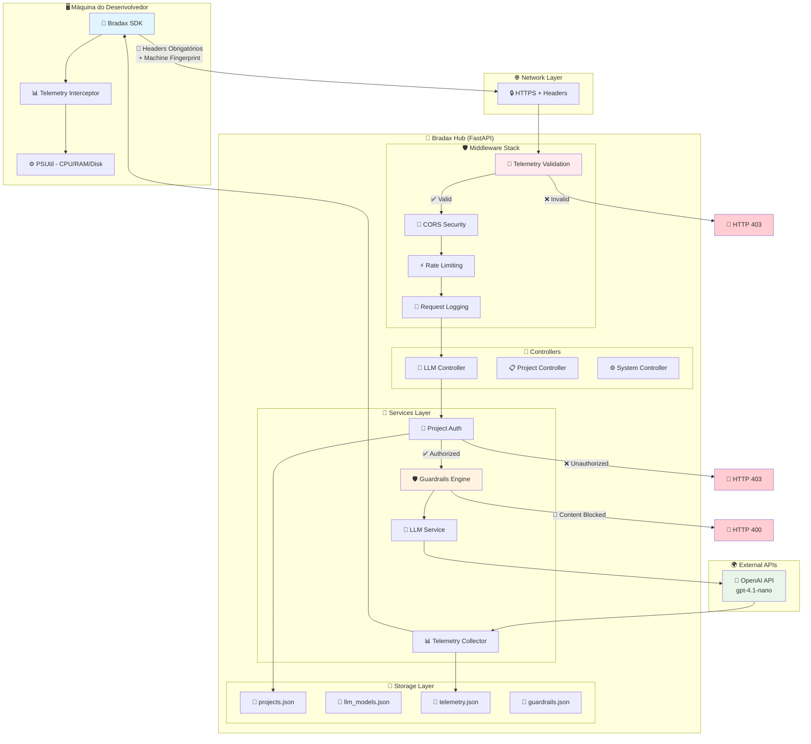
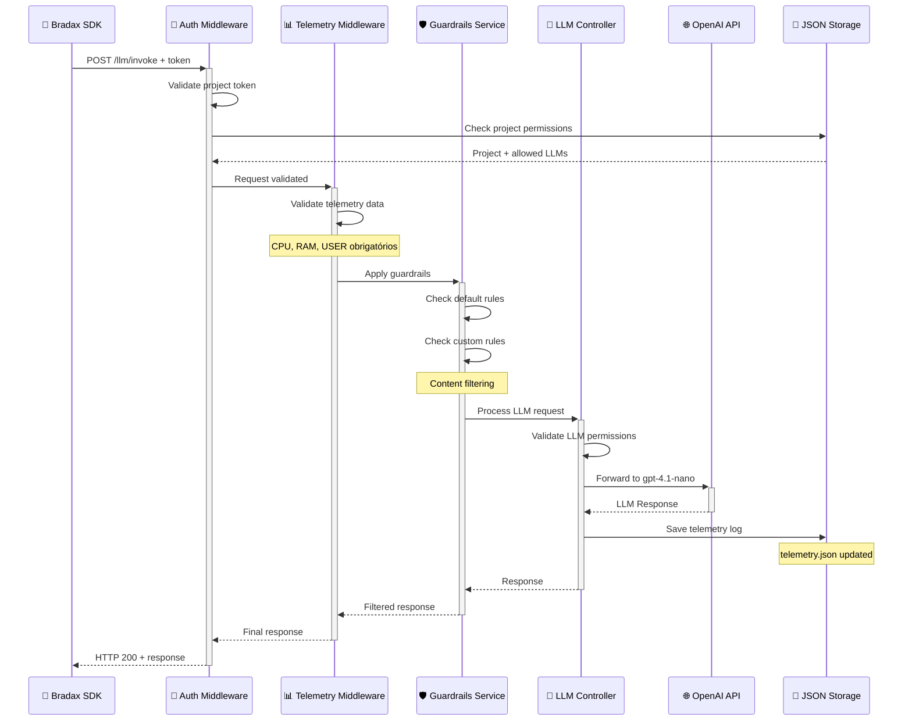
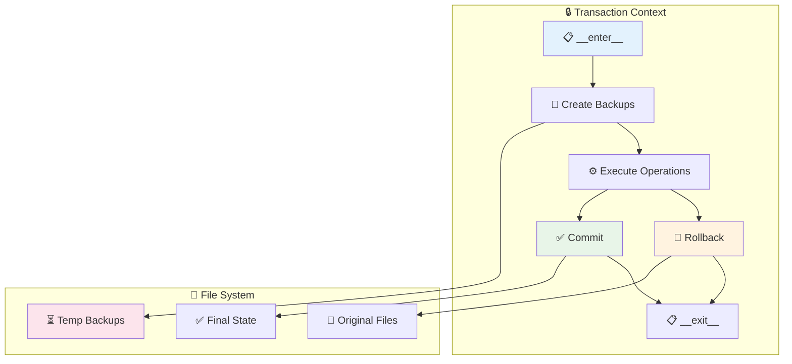
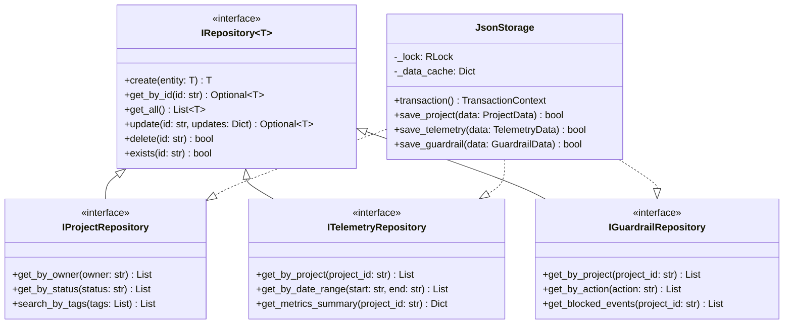
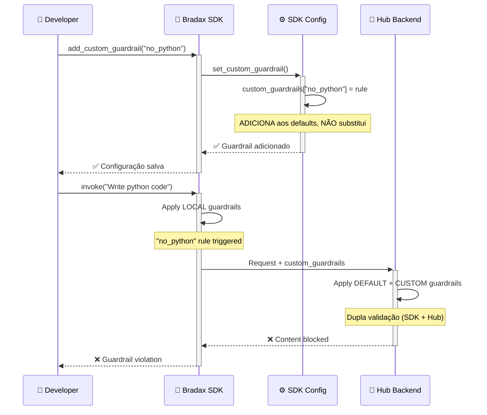
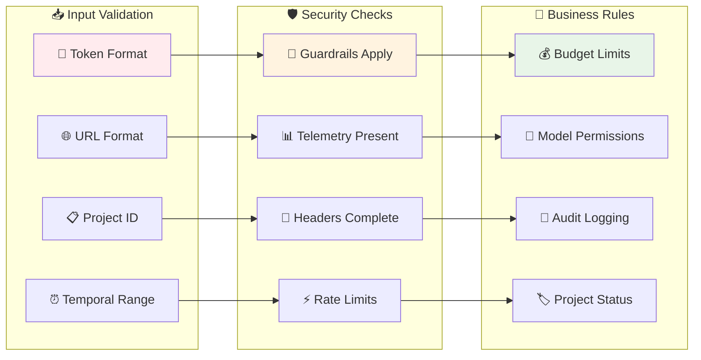

# 🏗️ **MEMÓRIA DA ARQUITETURA BRADAX**

# 🏗️ **MEMÓRIA DA ARQUITETURA BRADAX** 
*Análise Completa - Atualizada em 2025-08-09*

## **🎯 Visão Executiva**
Sistema de governança LLM com **interceptação obrigatória** de 100% das chamadas, telemetria completa da máquina local e guardrails inegociáveis. **Impossível burlar ou desabilitar** as proteções de auditoria.

---

## **📊 Arquitetura Geral - Fluxo Detalhado**



---

## **� Pontos de Controle Críticos**

### **1. 🚨 Checkpoint: Validação de Telemetria (Middleware)**
**Localização:** `middleware/telemetry_validation.py`
**Função:** Bloqueia 100% das requisições sem headers completos

```python
# Headers OBRIGATÓRIOS (não pode ser burlado)
required_headers = [
    "x-bradax-sdk-version",        # Versão do SDK
    "x-bradax-machine-fingerprint", # Hardware único
    "x-bradax-session-id",         # Sessão única
    "x-bradax-telemetry-enabled",  # DEVE ser "true"
    "x-bradax-environment",        # dev/prod
    "x-bradax-platform",           # OS
    "x-bradax-python-version"      # Python version
]
```

**❌ Falha:** HTTP 403 + Log de tentativa de bypass

### **2. 🔐 Checkpoint: Autenticação de Projeto**
**Localização:** `auth/project_auth.py`
**Função:** Valida token contra `projects.json`

```json
// Estrutura projects.json
{
  "project_id": "proj_test",
  "api_key_hash": "hash_do_token",
  "config": {
    "model": "gpt-4.1-nano",
    "allowed_llms": ["gpt-4.1-nano", "gpt-4o-mini"],
    "budget_limit": 1000,
    "guardrails_custom": ["no_python_code"]
  }
}
```

**❌ Falha:** HTTP 403 + Log de auth failure

### **3. 🛡️ Checkpoint: Guardrails Inegociáveis**
**Localização:** `services/guardrails.py`
**Função:** Aplica regras que NÃO podem ser desabilitadas

```python
# Regras PADRÃO (hardcoded - impossível remover)
DEFAULT_RULES = [
    "block_pii_data",      # Dados pessoais
    "block_credentials",   # Senhas/tokens
    "content_filter",      # Conteúdo inadequado
    "token_limit",         # Limite de tokens
    "rate_limiting"        # Controle de frequência
]

# Guardrails CUSTOMIZADOS (apenas adicionam proteção)
custom_rules = project_config.get("guardrails_custom", [])
```

**❌ Falha:** HTTP 400 + Log de content blocked

---

## **🔑 Componentes Críticos Detalhados**

### **🏢 HUB (Broker FastAPI)**

#### **� Middleware de Telemetria** 
**Arquivo:** `middleware/telemetry_validation.py`
- **Missão:** Bloquear 100% das tentativas de bypass da auditoria
- **Endpoints Protegidos:**
  - `/api/v1/llm/invoke` ← Principal
  - `/api/v1/llm/batch`
  - `/api/v1/llm/stream`
  - `/api/v1/vector/embed`
  - `/api/v1/graph/execute`
- **Validações:**
  - Headers obrigatórios completos
  - User-Agent = `bradax-sdk/x.x.x`
  - Machine fingerprint válido
  - `telemetry_enabled = true`
- **Segurança:** Logs automáticos de violações

#### **🤖 LLM Controller** 
**Arquivo:** `controllers/llm_controller.py` 
- **Missão:** Orquestrar validações e chamadas LLM
- **Fluxo:**
  1. Recebe requisição validada pelos middlewares
  2. Consulta ProjectAuth para verificar permissões
  3. Aplica GuardrailEngine 
  4. Chama LLMService → OpenAI
  5. Registra telemetria completa
- **Regras:**
  - Modelo deve estar na lista `allowed_llms` do projeto
  - Orçamento não pode ser excedido
  - Guardrails são aplicados SEMPRE

#### **🛡️ Guardrails Engine** 
**Arquivo:** `services/guardrails.py`
- **Missão:** Proteções inegociáveis + customizáveis
- **Tipos de Regra:**
  - `BLOCK` - Bloqueia completamente  
  - `SANITIZE` - Remove conteúdo problemático
  - `FLAG` - Marca para auditoria
  - `ALLOW` - Permite (apenas para whitelist)
- **Regras Padrão (IMPOSSÍVEL desabilitar):**
  - Detector de PII (CPF, emails, telefones)
  - Bloqueio de credenciais
  - Filtro de conteúdo inadequado
  - Limite de tokens por request
- **Regras Customizadas (Apenas ADICIONAM proteção):**
  - Definidas no `projects.json` por projeto
  - Exemplo: `no_python_code`, `block_finance_data`

### **🖥️ SDK Python**

#### **� Cliente Principal**
**Arquivo:** `client.py`
- **Missão:** Interface única, segura e auditada
- **Proteções Anti-Burla:**
  ```python
  # ⚠️ IMPOSSÍVEL desabilitar telemetria
  if 'telemetry_enabled' in kwargs and not kwargs['telemetry_enabled']:
      raise BradaxConfigurationError("🚨 Telemetria obrigatória!")
  
  if 'disable_telemetry' in kwargs:
      raise BradaxConfigurationError("🚨 Bypass detectado!")
  ```
- **Funcionalidades:**
  - Token obrigatório na inicialização
  - Headers automáticos de telemetria
  - Retry automático com backoff
  - Logs estruturados

#### **� Telemetry Interceptor**
**Arquivo:** `telemetry_interceptor.py`
- **Missão:** Coletar métricas da máquina local
- **Dados Coletados:**
  ```python
  machine_metrics = {
      "cpu_count": psutil.cpu_count(),
      "memory_total": psutil.virtual_memory().total,
      "disk_usage": psutil.disk_usage('/').percent,
      "platform": platform.system(),
      "python_version": platform.python_version(),
      "machine_fingerprint": sha256(hardware_info)[:16]
  }
  ```
- **Headers Gerados:**
  - Machine fingerprint (baseado em hardware)
  - Session ID único por execução
  - Timestamp preciso
  - Versão do SDK
- **Impossível Desabilitar:** Hardcoded no SDK
- **Função**: Coleta métricas da máquina local automaticamente
- **Headers gerados automaticamente**:
  - Machine fingerprint (baseado em hardware)
  - Session ID único
  - Versão do SDK
  - Platform info (OS, Python version)
  - CPU/RAM usage (via psutil)
- **Não pode ser desabilitado**: Hardcoded no SDK

---

## **💾 Estrutura de Storage (JSON)**

### **Arquivos de Dados**
- `data/projects.json` - Projetos cadastrados
- `data/llm_models.json` - Modelos LLM disponíveis  
- `data/telemetry.json` - Logs de telemetria
- `data/guardrails.json` - Logs de guardrails

### **Exemplo de Telemetria**
```json
{
  "event_id": "uuid",
  "timestamp": "2025-01-01T12:00:00Z",
  "project_id": "proj_test",
  "event_type": "request",
  "model_used": "gpt-4o-mini", 
  "tokens_consumed": 42,
  "duration_ms": 1250,
  "status_code": 200,
  "guardrail_triggered": null
}
```

---

## **🚨 Regras de Governança Inegociáveis**

### **1. Telemetria Obrigatória**
- **Middleware bloqueia** requisições sem headers completos
- **SDK não permite** desabilitar telemetria
- **Todas as interações** são logadas em JSON

### **2. Validação de Projetos**
- **Token obrigatório** para todas as operações
- **LLMs permitidos** controlados por projeto
- **Orçamento e limites** validados sempre

### **3. Guardrails Não-Burlávies**
- **Regras padrão** não podem ser removidas
- **Customizações** apenas adicionam proteção
- **Conteúdo bloqueado** não chega ao OpenAI

### **4. Auditoria Completa**
- **Logs estruturados** de todas as operações
- **Métricas de performance** sempre coletadas
- **Tentativas de bypass** são registradas como violação

---

## **🔄 Fluxo de Validação Detalhado**

### **Requisição SDK → Hub**
1. **SDK** adiciona headers de telemetria obrigatórios
2. **TelemetryValidationMiddleware** valida headers → Bloqueia se inválido
3. **ProjectAuth** valida token → Busca projeto em `projects.json`
4. **LLM Controller** verifica se modelo é permitido → Consulta `llm_registry`
5. **Guardrails** aplica regras de segurança → Bloqueia se necessário
6. **LLM Service** chama OpenAI (se passou em todas as validações)
7. **Telemetry Collector** registra evento em `telemetry.json`
8. **Response** retorna ao SDK

### **Pontos de Falha (Intencionais)**
- **Header faltando** → `HTTP 403` + log de tentativa de bypass
- **Token inválido** → `HTTP 403` + log de auth failure  
- **LLM não permitido** → `HTTP 403` + log de unauthorized model
- **Guardrail ativado** → `HTTP 400` + log de content blocked
- **Sem telemetria** → `HTTP 400` + log de compliance violation

---

## **🎯 Objetivos dos Testes**

### **Validar que o sistema:**
1. **Rejeita** requisições sem telemetria
2. **Bloqueia** tokens inválidos
3. **Impede** uso de LLMs não autorizados
4. **Aplica** guardrails sem bypass
5. **Registra** 100% das interações em JSON
6. **Mantém** governança mesmo com SDK customizado

### **Validar que os dados JSON refletem:**
1. **Telemetria** com métricas reais da máquina
2. **Projetos** com LLMs específicos permitidos
3. **Guardrails** com logs de bloqueios
4. **Performance** com tokens e tempos reais

---

## 🔄 **Fluxo Detalhado de Execução (Sequence Diagram)**



## 🧠 **Detalhamento Técnico dos Componentes**

### 🔧 **SDK - Bradax Client**
```python
# Principais responsabilidades identificadas:
class BradaxClient:
    def __init__(self, project_token: str):
        # ✅ Token obrigatório - sem bypass
        # ✅ Coleta automática de telemetria
        # ✅ Interceptador sempre ativo
        
    async def invoke(self, prompt: str, **kwargs):
        # 🚨 SEMPRE envia telemetria da máquina
        # 🚨 SEMPRE valida token antes do envio
        # 🚨 SEMPRE aplica guardrails configurados
```

**Telemetria Coletada Automaticamente:**
- 🖥️ **CPU Usage** (via psutil)
- 🧠 **RAM Usage** (via psutil) 
- 💾 **Disk Usage** (via psutil)
- 👤 **Username** (via os.getenv)
- ⏰ **Timestamp** (ISO UTC)
- 🔍 **Process ID** e **Thread ID**

### 🏢 **Hub - FastAPI Backend**

#### 🛡️ **Middleware Stack (Ordem de Execução)**
1. **🚨 Telemetry Validation** - Rejeita sem telemetria
2. **🔐 CORS Security** - Headers e origins
3. **⚡ Rate Limiting** - Throttling por projeto
4. **📝 Request Logging** - Auditoria completa

#### 🎯 **Controladores**
```python
# LLM Controller - Orquestrador principal
@router.post("/llm/invoke")
async def invoke_llm():
    # 1. Valida projeto e token
    # 2. Verifica LLM permitido
    # 3. Aplica guardrails
    # 4. Chama OpenAI
    # 5. Salva telemetria
    # 6. Retorna response filtrada
```

#### 🔬 **Services Layer**

**🔑 Project Auth Service:**
- Validação de tokens em `projects.json`
- Controle de LLMs permitidos por projeto
- Gerenciamento de permissões

**🛡️ Guardrails Engine:**
- Regras padrão INEGOCIÁVEIS
- Regras customizadas por projeto
- Filtragem de conteúdo sensível
- Logs de bloqueios

**🤖 LLM Service:**
- Proxy para OpenAI API
- Uso exclusivo do gpt-4.1-nano
- Rate limiting específico
- Token counting e billing

**📊 Telemetry Collector:**
- Persistência em `telemetry.json`
- Métricas de performance
- Auditoria de uso
- Agregações para dashboards

## 📁 **Estrutura de Dados JSON**

### `projects.json` - Configuração de Projetos
```json
{
  "project_id": "meu-projeto",
  "name": "Meu Projeto Awesome", 
  "project_token": "bradax_token_abc123",
  "allowed_llms": ["gpt-4.1-nano"],
  "custom_guardrails": [
    {
      "name": "no_python_code",
      "pattern": "python|def |import ",
      "action": "block"
    }
  ],
  "rate_limits": {
    "requests_per_minute": 60,
    "tokens_per_day": 10000
  },
  "created_at": "2025-08-09T17:33:58Z",
  "enabled": true
}
```

### `llm_models.json` - Catálogo de Modelos
```json
{
  "model_id": "gpt-4.1-nano",
  "name": "GPT-4.1 Nano",
  "provider": "openai",
  "max_tokens": 2048,
  "cost_per_1k_input": 0.001,
  "cost_per_1k_output": 0.002,
  "capabilities": ["text", "analysis"],
  "enabled": true,
  "version": "2025-08"
}
```

### `telemetry.json` - Logs de Execução
```json
{
  "timestamp": "2025-08-09T17:45:22Z",
  "project_id": "meu-projeto",
  "llm_model": "gpt-4.1-nano",
  "prompt_tokens": 25,
  "completion_tokens": 150,
  "total_tokens": 175,
  "response_time_ms": 1250,
  "machine_metrics": {
    "cpu_percent": 45.2,
    "ram_percent": 67.8,
    "disk_percent": 23.1,
    "username": "developer",
    "process_id": 12345
  },
  "guardrails_applied": ["default_content_filter"],
  "status": "success"
}
```

## 🚨 **Pontos de Falha e Validações**

### ❌ **Cenários de Rejeição (HTTP Status)**
- **400 Bad Request**: Telemetria ausente ou inválida
- **403 Forbidden**: Token inválido ou LLM não permitido  
- **429 Too Many Requests**: Rate limiting excedido
- **500 Internal Error**: Falha na comunicação com OpenAI

### ✅ **Validações Obrigatórias**
1. **Token presente e válido** em `projects.json`
2. **LLM solicitado** está em `allowed_llms`
3. **Telemetria completa** (CPU, RAM, User) presente
4. **Guardrails** aplicados sem bypass
5. **Rate limits** respeitados
6. **Logs** salvos em `telemetry.json`

---

## 🗄️ **Sistema de Storage Sofisticado**

### 💾 **JsonStorage com Transações Atômicas**
O sistema possui um mecanismo de **transações ACID** que garante consistência total:



**🔥 Características Críticas:**
- **Thread-Safe**: `threading.RLock()` em todas as operações
- **Atomic Operations**: Todas as mudanças ou nenhuma
- **Auto-Backup**: Backup automático antes de modificações
- **Auto-Recovery**: Rollback automático em caso de falha
- **Cache Consistency**: Recarregamento automático do cache

### 📊 **Estruturas de Dados Detalhadas**

#### **ProjectData** - Projetos Completos
```python
@dataclass
class ProjectData:
    project_id: str          # Identificador único
    name: str               # Nome amigável
    created_at: str         # ISO timestamp
    updated_at: str         # ISO timestamp  
    status: str = "active"  # active|inactive|suspended
    config: Dict            # Configurações específicas
    api_key_hash: str       # Hash seguro da API key
    owner: str              # Proprietário do projeto
    description: str        # Descrição detalhada
    tags: List[str]         # Tags para categorização
```

#### **TelemetryData** - Telemetria Unificada
```python
@dataclass  
class TelemetryData:
    # 🔑 Identificação
    telemetry_id: str       # UUID único do evento
    project_id: str         # Projeto associado
    timestamp: str          # ISO UTC timestamp
    event_type: str         # request|error|system
    
    # 🌐 Context HTTP
    request_id: str         # ID da request HTTP
    user_id: str           # Usuário da máquina
    endpoint: str          # /llm/invoke
    method: str            # POST|GET|PUT
    
    # ⚡ Performance 
    status_code: int        # 200|400|403|500
    response_time_ms: float # Latência total
    request_size: int       # Bytes enviados
    response_size: int      # Bytes recebidos
    
    # 🤖 LLM Specifics
    model_used: str         # gpt-4.1-nano
    tokens_used: int        # Tokens consumidos
    cost_usd: float        # Custo calculado
    
    # 🚨 Error Handling
    error_type: str         # ValidationError|AuthError
    error_message: str      # Mensagem detalhada
    error_code: str        # ERR_001, ERR_002
    
    # 🛡️ Security
    guardrail_triggered: str # Nome do guardrail ativado
    
    # 🖥️ System Metrics (via psutil)
    system_info: Dict = {
        "cpu_percent": 45.2,
        "memory_percent": 67.8,
        "disk_percent": 23.1,
        "username": "developer",
        "process_id": 12345,
        "platform": "Windows-10",
        "python_version": "3.10.0"
    }
```

#### **GuardrailData** - Logs de Segurança
```python
@dataclass
class GuardrailData:
    event_id: str           # UUID do evento
    project_id: str         # Projeto que triggou
    guardrail_name: str     # Nome da regra
    action: str            # block|warn|allow
    content_hash: str      # Hash do conteúdo
    triggered_at: str      # Timestamp ISO
    details: Dict          # Detalhes específicos
```

### 🏗️ **Repository Pattern Implementation**

O sistema implementa **Repository Pattern** profissional:



### 🔧 **Usage Pattern - Transações Seguras**

```python
# ✅ Padrão correto - Transação atômica
with storage.transaction() as tx:
    # Múltiplas operações em uma transação
    await storage.save_project(project_data)
    await storage.save_telemetry(telemetry_data) 
    await storage.save_guardrail(guardrail_data)
    # Se qualquer operação falhar, ROLLBACK automático
    tx.commit()  # Opcional - commit automático no __exit__

# ❌ Padrão inadequado - Operações isoladas
await storage.save_project(project_data)     # Pode falhar
await storage.save_telemetry(telemetry_data)     # Estado inconsistente
```

---

## 🔧 **SDK - Análise Detalhada da Arquitetura**

### 🎛️ **Sistema de Configuração Avançado**

O SDK possui um sistema de configuração extremamente flexível e robusto:

```mermaid
graph TB
    subgraph "🌍 Environment Sources"
        ENV_VARS[🔧 Environment Variables]
        CONSTANTS[📋 bradax-constants]
        DEFAULTS[⚙️ Default Values]
    end
    
    subgraph "🏗️ Configuration Factories"
        FROM_ENV[from_environment()]
        FOR_TEST[for_testing()]  
        FOR_PROD[for_production()]
        CUSTOM[custom_config()]
    end
    
    subgraph "⚙️ SDK Config Object"
        CONFIG[📊 BradaxSDKConfig]
        GUARDRAILS[🛡️ custom_guardrails]
        TELEMETRY[📡 telemetry_settings]
        NETWORK[🌐 network_config]
    end
    
    ENV_VARS --> FROM_ENV
    CONSTANTS --> FROM_ENV
    DEFAULTS --> FROM_ENV
    
    FROM_ENV --> CONFIG
    FOR_TEST --> CONFIG
    FOR_PROD --> CONFIG
    CUSTOM --> CONFIG
    
    CONFIG --> GUARDRAILS
    CONFIG --> TELEMETRY
    CONFIG --> NETWORK
    
    style FROM_ENV fill:#e3f2fd
    style CONFIG fill:#e8f5e8
    style GUARDRAILS fill:#fff3e0
```

### 🔑 **Características da Configuração**

```python
@dataclass
class BradaxSDKConfig:
    # 🌐 Network & Connection
    broker_url: str              # http://localhost:8000 (dev)
    timeout: int                 # 30s (prod) / 5s (test)
    
    # 🔐 Authentication
    project_id: str              # Identificador do projeto
    api_key_prefix: str          # "bradax_" (security)
    
    # 🛡️ Guardrails System
    enable_guardrails: bool      # True (NUNCA pode ser False globalmente)
    custom_guardrails: Dict      # Adicionais aos defaults
    guardrail_rules: List        # ["default"] + customizadas
    
    # 📊 Telemetry System  
    enable_telemetry: bool       # True (obrigatório para funcionamento)
    local_telemetry_enabled: bool # Coleta local ativa
    telemetry_buffer_size: int   # 100 eventos em buffer
    
    # 🏷️ Environment Context
    environment: str             # development|testing|production
    debug: bool                  # True em dev/test
    
    # 🎯 Validation Rules
    min_valid_year: int          # 2024 (validação temporal)
    max_valid_year: int          # 2035 (validação temporal)
    
    # ⚙️ Extensibility
    custom_settings: Dict        # Configurações específicas do usuário
```

### 🛡️ **Sistema de Guardrails - Arquitetura de Segurança**

**REGRA FUNDAMENTAL:** O SDK permite **ADICIONAR** guardrails, mas **NUNCA DESABILITAR** os defaults do projeto.



### 📡 **Sistema de Telemetria - Coleta Automática**

O SDK coleta telemetria automaticamente **sem possibilidade de bypass**:

```python
class TelemetryInterceptor:
    """Interceptador que coleta dados automaticamente"""
    
    def collect_system_metrics(self) -> Dict[str, Any]:
        return {
            # 🖥️ Hardware Metrics (via psutil)
            "cpu_percent": psutil.cpu_percent(interval=0.1),
            "memory_percent": psutil.virtual_memory().percent,
            "disk_percent": psutil.disk_usage('/').percent,
            
            # 👤 User Context
            "username": os.getenv('USERNAME') or os.getenv('USER'),
            "process_id": os.getpid(),
            "thread_id": threading.get_ident(),
            
            # 🏷️ Platform Info
            "platform": platform.system(),
            "python_version": platform.python_version(),
            "sdk_version": "1.0.0",
            
            # ⏰ Temporal Context
            "timestamp": datetime.utcnow().isoformat() + "Z",
            "timezone": str(datetime.now().astimezone().tzinfo)
        }
```

### 🔄 **Factory Patterns - Configurações por Contexto**

```python
# 🧪 Para Testes
config = BradaxSDKConfig.for_testing(
    broker_url="http://localhost:8000",
    project_id="proj_test_123", 
    timeout=5,                    # Timeout reduzido
    debug=True                    # Debug ativo
)

# 🏭 Para Produção
config = BradaxSDKConfig.for_production(
    broker_url="https://api.bradax.com",
    project_id="proj_prod_456",
    timeout=30,                   # Timeout normal
    debug=False,                  # Debug desativado
    budget_limit=1000.0           # Limite de gastos
)

# 🌍 Do Environment
config = BradaxSDKConfig.from_environment()
# Lê: BRADAX_SDK_BROKER_URL, BRADAX_SDK_PROJECT_ID, etc.
```

### 🔒 **Validações e Segurança**

O SDK implementa múltiplas camadas de validação:



### 🎭 **Singleton Pattern - Configuração Global**

```python
# 🌍 Global SDK Configuration
_sdk_config: Optional[BradaxSDKConfig] = None

def get_sdk_config() -> BradaxSDKConfig:
    """Retorna configuração global (singleton)"""
    global _sdk_config
    if _sdk_config is None:
        _sdk_config = BradaxSDKConfig.from_environment()
    return _sdk_config

# ✅ Thread-safe access em toda aplicação
config = get_sdk_config()
```

### 🚨 **Pontos Críticos de Segurança**

1. **🛡️ Guardrails Inegociáveis**: Defaults do projeto NUNCA podem ser desabilitados
2. **📊 Telemetria Obrigatória**: SDK não funciona sem coleta de telemetria
3. **🔑 Token Validation**: Validação rigorosa de formato e existência
4. **⏰ Request Timeout**: Protege contra requests infinitos
5. **💰 Budget Control**: Limites de gasto por projeto (produção)
6. **🔒 Audit Trail**: Todos os requests são logados com contexto completo
```
