# Arquitetura Bradax (Memória Técnica)

Atualização: 2025-08-19
Plataforma de governança para chamadas LLM com: autenticação JWT derivada por projeto, guardrails determinísticos centralizados e telemetria estruturada em arquivos JSON. Único provider ativo: OpenAI (modelos gpt-4.x / gpt-4o*). Sem banco/Redis/Vault ainda.

## 2. Mapa de Componentes

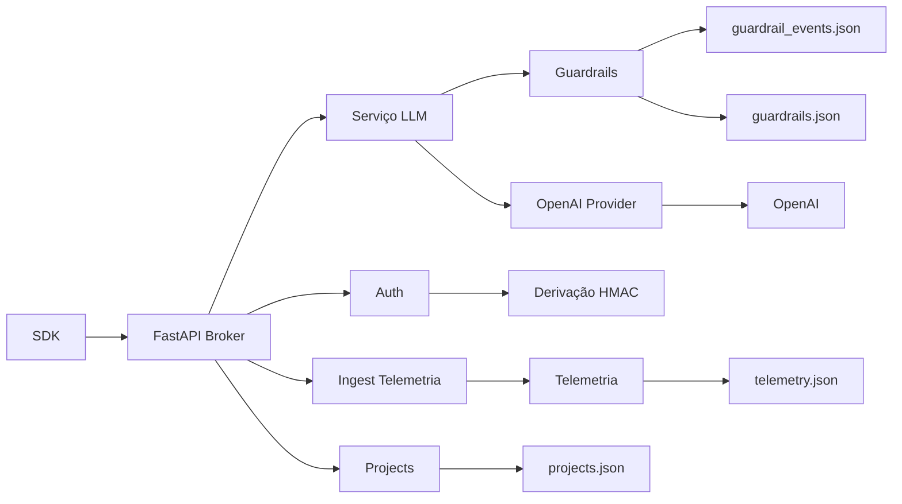

### 2.1 Stack de Middlewares (Ordem)

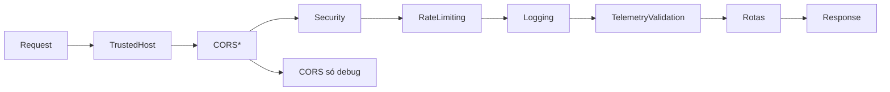

### 2.2 Separação de Observabilidade

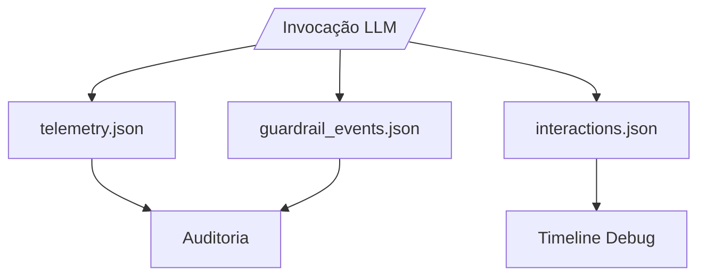


## 3. Fluxo /llm/invoke

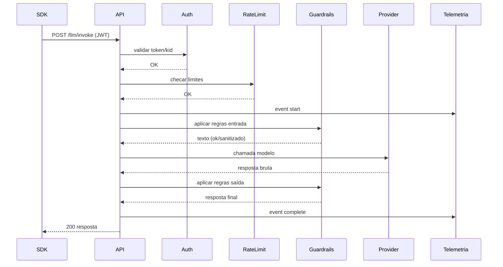

## 4. Fluxo JWT (Emissão / Validação)

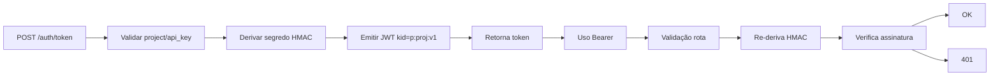

## 5. Guardrails

- Fonte única: `data/guardrails.json`
- Tipos de ação: allow / sanitize / block / flag
- Execução em duas fases: entrada e saída
- Eventos persistidos em `guardrail_events.json`
- Roadmap: análise contextual via LLM (não implementado)

Pipeline:

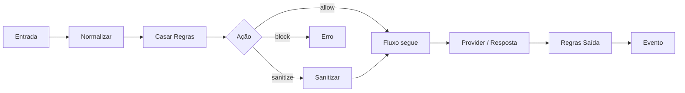

### 5.1 Fases Detalhadas (Entrada → Saída)

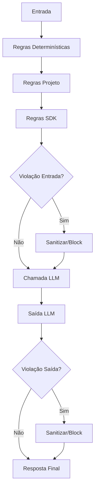

### 5.2 Estado da Análise via LLM

O código do engine inclui método `_llm_content_analysis` e lógica condicional para regras de categorias `content_safety`, `business`, `compliance`. Condições para ativação:

- `self.llm_service` deve ser injetado externamente (atualmente é `None`).
- Regra pertencente a uma das categorias acima.

Na execução atual (bootstrap padrão) nenhuma injeção ocorre, logo:

| Aspecto | Situação Atual |
|---------|----------------|
| Injeção de LLM | Não realizada |
| Chamadas LLM por guardrails | 0 |
| Override de falsos positivos | Inativo |
| Escalonamento de confiança (>0.7) | Inativo |
| Custo adicional | Zero |

Consequência: decisões puramente determinísticas (regex + keywords + whitelist + sanitização). Ativação futura exigirá ponto de composição que forneça `LLMService` após criação do singleton sem criar dependência circular.

Roadmap sugerido:

1. Injeção via função `enable_llm_analysis(llm_service)`.
2. Cache de prompts de análise por regra.
3. Limite de chamadas LLM por request para controlar custo.
4. Registro separado de decisões LLM (arquivo `guardrail_llm_events.json`).

## 6. Telemetria

Arquivo append-line `telemetry.json` com eventos: request_start, request_complete, error, authentication.

Lifecycle:

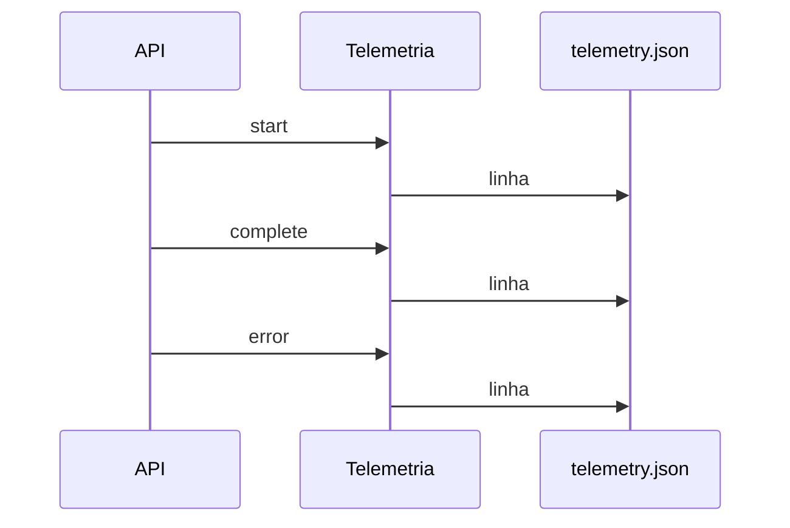

### 6.1 Detalhamento de Eventos

| Campo | Origem | Observação |
|-------|--------|------------|
| event_id | uuid4 | Sufixo `_complete` para evento de fechamento |
| event_type | aplicação | `request_start`/`request_complete`/`error`/`authentication` |
| project_id | request | Em `request_complete` ainda vazio (TODO correlacionar) |
| endpoint/method | scope FastAPI | Apenas no início/autenticação |
| duration_ms | caller | Não calculado internamente (passado no record_complete) |
| model_used/tokens_consumed | LLM Service | Preenchido se disponível |
| cost_usd | LLM Service | Cálculo externo simples (roadmap granular) |
| guardrail_triggered | (deprecado) | Nunca mais usado (separado) |
| metadata | caller | Campos adicionais livres |

Persistência: `_add_event` executa `_flush_cache` imediatamente (carrega arquivo inteiro, anexa, sobrescreve). Alta durabilidade; custo I/O elevado. Roadmap: buffer + flush batch.

Métricas: `get_project_metrics()` faz varredura O(n) para agregar totals, médias e error_rate. Escalabilidade limitada – considerar indexação ou storage estruturado futuro.

### 6.2 Fontes de Observabilidade

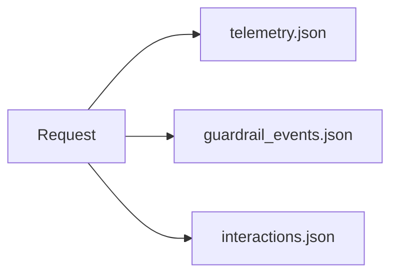

`guardrail_events.json`: somente eventos block/sanitize/flag (evita poluir telemetria).
`interactions.json`: estágios detalhados (até 5000), ignora eventos PASS por padrão.

### 6.1 Persistência (Arquivos)

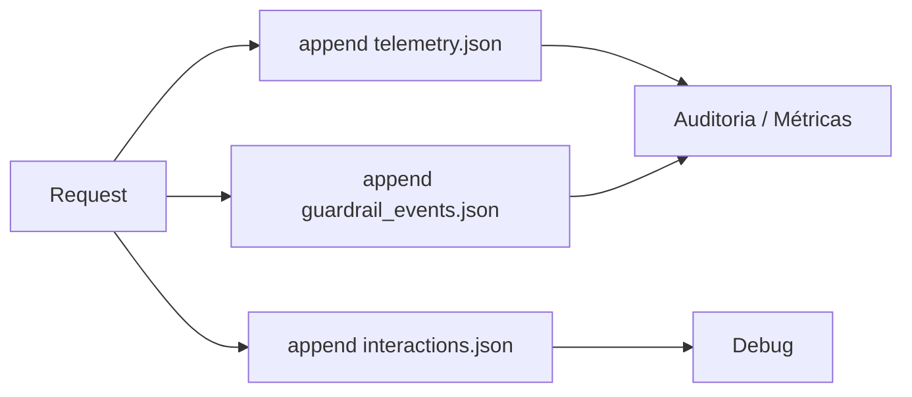

## 7. Dados Persistidos

| Arquivo | Uso | Escrita | Observação |
|---------|-----|---------|------------|
| projects.json | Metadados projetos | overwrite atômica | Budget, allowed_models |
| guardrails.json | Regras fixas | leitura | Fonte única |
| telemetry.json | Eventos request | append | Uma linha por evento |
| guardrail_events.json | Eventos guardrail | append | block / sanitize |
| llm_models.json | Catálogo modelos | leitura | Lista global |

## 8. Rate Limiting

Middleware in-memory (por IP) com limites configuráveis por env: RPM, RPH e concorrência. Roadmap: backend distribuído (Redis) + token bucket.

## 9. Segurança

- JWT derivado: nenhum segredo derivado armazenado
- Headers de segurança básicos (no-store, X-Content-Type)
- Sem CORS em produção (apenas dev)
- Sem exposição de segredo em logs (`signing_strategy` apenas metadado)

### 9.1 Fail-Fast de Inicialização

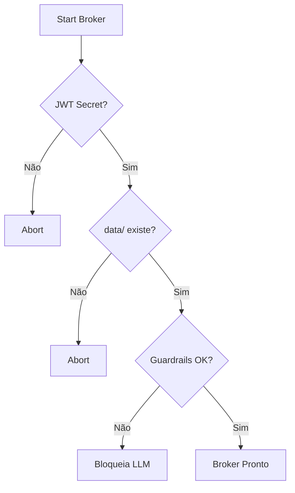

## 10. Endpoints Atuais (Resumo)

| Grupo | Endpoint | Método | Status |
|-------|----------|--------|--------|
| Auth | /api/v1/auth/token | POST | OK |
| Auth | /api/v1/auth/validate | POST | OK |
| LLM | /api/v1/llm/invoke | POST | OK |
| LLM | /api/v1/llm/models | GET | OK |
| Projects | /api/v1/projects/ | CRUD | OK |
| System | /api/v1/system/info | GET | OK |
| System | /api/v1/system/health | GET | OK |
| Metrics | /api/v1/metrics/system | GET | OK |
| Telemetry | /api/v1/system/telemetry | POST | OK |

## 11. Divergências / Roadmap

| Item | Situação |
|------|----------|
| Multi-provider (Anthropic/Gemini) | Não implementado |
| Streaming / batch invoke | Não implementado |
| Vector / graph endpoints | Não implementado |
| Redis / Vault | Não implementado |
| Rotação de segredos v2 | Não implementado |
| Guardrails com LLM | Não implementado |
| Prometheus / agregação | Não implementado |

## 12. Riscos & Mitigações

| Risco | Impacto | Mitigação Atual | Próximo Passo |
|-------|---------|-----------------|---------------|
| Storage arquivo único | Corrupção / lock | Escrita atômica simples | Migrar p/ Redis/DB |
| Rate limiting local | Escala horizontal | Limites conservadores | Backend distribuído |
| Ausência de rotação de chave | Longa exposição | Derivação por projeto reduz escopo | Planejar v2 + KMS |
| Telemetria sem agregação | Análise manual lenta | Estrutura JSON simples | Pipeline ETL + agregador |

## 13. Referências de Código

| Área | Arquivo Principal |
|------|------------------|
| App Factory | `broker/main.py` |
| Config/Env | `broker/config.py` |
| Constantes | `broker/constants.py` |
| LLM Service | `services/llm/service.py` |
| Guardrails | `services/guardrails.py` |
| Telemetria | `services/telemetry.py` |
| JWT | `auth` (derivação implementada em lógica de token) |
| Middlewares | `middleware/*.py` |

## 14. Próximos Passos Técnicos (Prioridade)

1. Persistência Redis para rate limiting & locks
2. Rotação de segredos (introduzir kid v2)
3. Multi-provider (abstrair providers dinâmicos)
4. Guardrails contextual (integração opcional LLM)
5. Pipeline agregador telemetria + métricas Prometheus

---
Documento minimizado e normalizado para refletir apenas o que existe + gaps claros.

---

<!-- conteúdo legado removido definitivamente -->

## 🧠 **Detalhamento Técnico dos Componentes**

### 🔧 **SDK - Bradax Client**

```python
# Principais responsabilidades identificadas:
class BradaxClient:
    def __init__(self, project_token: str):
        # ✅ Token obrigatório - sem bypass
        # ✅ Coleta automática de telemetria
        # ✅ Interceptador sempre ativo

    async def invoke(self, prompt: str, **kwargs):
        # 🚨 SEMPRE envia telemetria da máquina
        # 🚨 SEMPRE valida token antes do envio
        # 🚨 SEMPRE aplica guardrails configurados

**Telemetria Coletada Automaticamente:**

- 🖥️ **CPU Usage** (via psutil)
- 🧠 **RAM Usage** (via psutil)
- 💾 **Disk Usage** (via psutil)
- 👤 **Username** (via os.getenv)
- ⏰ **Timestamp** (ISO UTC)
- 🔍 **Process ID** e **Thread ID**

### 🏢 **Hub - FastAPI Backend**

#### 🛡️ **Middleware Stack (Ordem de Execução)**

1. **🚨 Telemetry Validation** - Rejeita sem telemetria
2. **🔐 CORS Security** - Headers e origins
3. **⚡ Rate Limiting** - Throttling por projeto
4. **📝 Request Logging** - Auditoria completa

#### 🎯 **Controladores**

```python
# LLM Controller - Orquestrador principal
@router.post("/llm/invoke")
async def invoke_llm():
    # 1. Valida projeto e token
    # 2. Verifica LLM permitido
    # 3. Aplica guardrails
    # 4. Chama OpenAI
    # 5. Salva telemetria
    # 6. Retorna response filtrada
```

#### 🔬 **Services Layer**

**🔑 Project Auth Service:**

- Validação de tokens em `projects.json`
- Controle de LLMs permitidos por projeto
- Gerenciamento de permissões

**🛡️ Guardrails Engine:**

- Regras padrão INEGOCIÁVEIS
- Regras customizadas por projeto
- Filtragem de conteúdo sensível
- Logs de bloqueios

**🤖 LLM Service:**

- Proxy para OpenAI API
- Uso exclusivo do gpt-4.1-nano
- Rate limiting específico
- Token counting e billing

**📊 Telemetry Collector:**

- Persistência em `telemetry.json`
- Métricas de performance
- Auditoria de uso
- Agregações para dashboards

## 📁 **Estrutura de Dados JSON**

### `projects.json` - Configuração de Projetos

```json
{
  "project_id": "meu-projeto",
  "name": "Meu Projeto Awesome",
  "project_token": "bradax_token_abc123",
  "allowed_llms": ["gpt-4.1-nano"],
  "custom_guardrails": [
    {
      "name": "no_python_code",
      "pattern": "python|def |import ",
      "action": "block"
    }
  ],
  "rate_limits": {
    "requests_per_minute": 60,
    "tokens_per_day": 10000
  },
  "created_at": "2025-08-09T17:33:58Z",
  "enabled": true
}
```

### `llm_models.json` - Catálogo de Modelos

```json
{
  "model_id": "gpt-4.1-nano",
  "name": "GPT-4.1 Nano",
  "provider": "openai",
  "max_tokens": 2048,
  "cost_per_1k_input": 0.001,
  "cost_per_1k_output": 0.002,
  "capabilities": ["text", "analysis"],
  "enabled": true,
  "version": "2025-08"
}
```

### `telemetry.json` - Logs de Execução

```json
{
  "timestamp": "2025-08-09T17:45:22Z",
  "project_id": "meu-projeto",
  "llm_model": "gpt-4.1-nano",
  "prompt_tokens": 25,
  "completion_tokens": 150,
  "total_tokens": 175,
  "response_time_ms": 1250,
  "machine_metrics": {
    "cpu_percent": 45.2,
    "ram_percent": 67.8,
    "disk_percent": 23.1,
    "username": "developer",
    "process_id": 12345
  },
  "guardrails_applied": ["default_content_filter"],
  "status": "success"
}
```

## 🚨 **Pontos de Falha e Validações**

### ❌ **Cenários de Rejeição (HTTP Status)**

- **400 Bad Request**: Telemetria ausente ou inválida
- **403 Forbidden**: Token inválido ou LLM não permitido
- **429 Too Many Requests**: Rate limiting excedido
- **500 Internal Error**: Falha na comunicação com OpenAI

### ✅ **Validações Obrigatórias**

1. **Token presente e válido** em `projects.json`
2. **LLM solicitado** está em `allowed_llms`
3. **Telemetria completa** (CPU, RAM, User) presente
4. **Guardrails** aplicados sem bypass
5. **Rate limits** respeitados
6. **Logs** salvos em `telemetry.json`

---

## 🗄️ **Sistema de Storage Sofisticado**

### 💾 **JsonStorage com Transações Atômicas**

O sistema possui um mecanismo de **transações ACID** que garante consistência total:

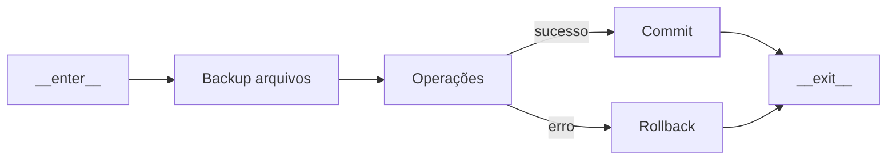

**🔥 Características Críticas:**

- **Thread-Safe**: `threading.RLock()` em todas as operações
- **Atomic Operations**: Todas as mudanças ou nenhuma
- **Auto-Backup**: Backup automático antes de modificações
- **Auto-Recovery**: Rollback automático em caso de falha
- **Cache Consistency**: Recarregamento automático do cache

### 📊 **Estruturas de Dados Detalhadas**

#### **ProjectData** - Projetos Completos

```python
@dataclass
class ProjectData:
    project_id: str          # Identificador único
    name: str               # Nome amigável
    created_at: str         # ISO timestamp
    updated_at: str         # ISO timestamp
    status: str = "active"  # active|inactive|suspended
    config: Dict            # Configurações específicas
    api_key_hash: str       # Hash seguro da API key
    owner: str              # Proprietário do projeto
    description: str        # Descrição detalhada
    tags: List[str]         # Tags para categorização
```

#### **TelemetryData** - Telemetria Unificada

```python
@dataclass
class TelemetryData:
    # 🔑 Identificação
    telemetry_id: str       # UUID único do evento
    project_id: str         # Projeto associado
    timestamp: str          # ISO UTC timestamp
    event_type: str         # request|error|system

    # 🌐 Context HTTP
    request_id: str         # ID da request HTTP
    user_id: str           # Usuário da máquina
    endpoint: str          # /llm/invoke
    method: str            # POST|GET|PUT

    # ⚡ Performance
    status_code: int        # 200|400|403|500
    response_time_ms: float # Latência total
    request_size: int       # Bytes enviados
    response_size: int      # Bytes recebidos

    # 🤖 LLM Specifics
    model_used: str         # gpt-4.1-nano
    tokens_used: int        # Tokens consumidos
    cost_usd: float        # Custo calculado

    # 🚨 Error Handling
    error_type: str         # ValidationError|AuthError
    error_message: str      # Mensagem detalhada
    error_code: str        # ERR_001, ERR_002

    # 🛡️ Security
    guardrail_triggered: str # Nome do guardrail ativado

    # 🖥️ System Metrics (via psutil)
    system_info: Dict = {
        "cpu_percent": 45.2,
        "memory_percent": 67.8,
        "disk_percent": 23.1,
        "username": "developer",
        "process_id": 12345,
        "platform": "Windows-10",
        "python_version": "3.10.0"
    }
```

#### **GuardrailData** - Logs de Segurança

```python
@dataclass
class GuardrailData:
    event_id: str           # UUID do evento
    project_id: str         # Projeto que triggou
    guardrail_name: str     # Nome da regra
    action: str            # block|warn|allow
    content_hash: str      # Hash do conteúdo
    triggered_at: str      # Timestamp ISO
    details: Dict          # Detalhes específicos
```

### 🏗️ **Repository Pattern Implementation**

O sistema implementa **Repository Pattern** profissional:

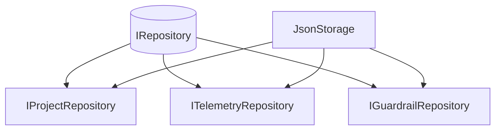

### 🔧 **Usage Pattern - Transações Seguras**

```python
# ✅ Padrão correto - Transação atômica
with storage.transaction() as tx:
    # Múltiplas operações em uma transação
    await storage.save_project(project_data)
    await storage.save_telemetry(telemetry_data)
    await storage.save_guardrail(guardrail_data)
    # Se qualquer operação falhar, ROLLBACK automático
    tx.commit()  # Opcional - commit automático no __exit__

# ❌ Padrão inadequado - Operações isoladas
await storage.save_project(project_data)     # Pode falhar
await storage.save_telemetry(telemetry_data)     # Estado inconsistente
```

---

## 🔧 **SDK - Análise Detalhada da Arquitetura**

### 🎛️ **Sistema de Configuração Avançado**

O SDK possui um sistema de configuração extremamente flexível e robusto:

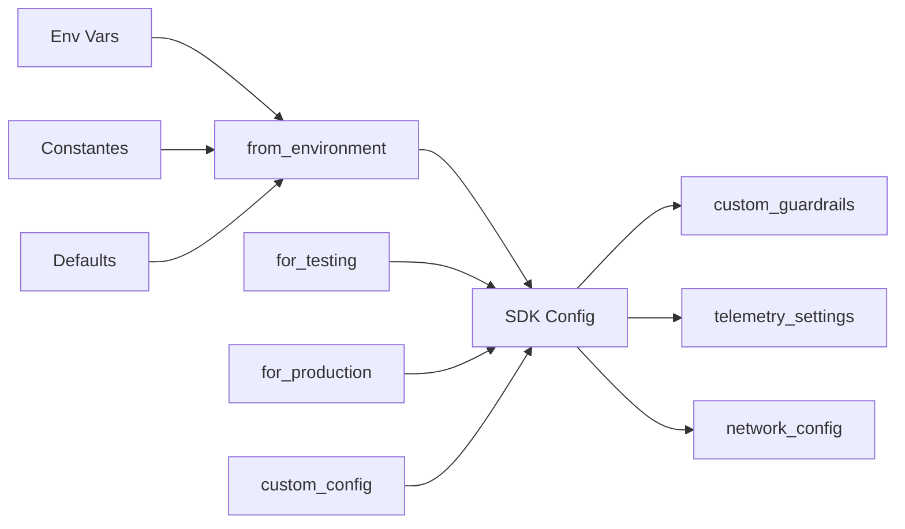

### 🔑 **Características da Configuração**

```python
@dataclass
class BradaxSDKConfig:
    # 🌐 Network & Connection
    broker_url: str              # http://localhost:8000 (dev)
    timeout: int                 # 30s (prod) / 5s (test)

    # 🔐 Authentication
    project_id: str              # Identificador do projeto
    api_key_prefix: str          # "bradax_" (security)

    # 🛡️ Guardrails System
    enable_guardrails: bool      # True (NUNCA pode ser False globalmente)
    custom_guardrails: Dict      # Adicionais aos defaults
    guardrail_rules: List        # ["default"] + customizadas

    # 📊 Telemetry System
    enable_telemetry: bool       # True (obrigatório para funcionamento)
    local_telemetry_enabled: bool # Coleta local ativa
    telemetry_buffer_size: int   # 100 eventos em buffer

    # 🏷️ Environment Context
    environment: str             # development|testing|production
    debug: bool                  # True em dev/test

    # 🎯 Validation Rules
    min_valid_year: int          # 2024 (validação temporal)
    max_valid_year: int          # 2035 (validação temporal)

    # ⚙️ Extensibility
    custom_settings: Dict        # Configurações específicas do usuário
```

### 🛡️ **Sistema de Guardrails - Arquitetura de Segurança**

**REGRA FUNDAMENTAL:** O SDK permite **ADICIONAR** guardrails, mas **NUNCA DESABILITAR** os defaults do projeto.

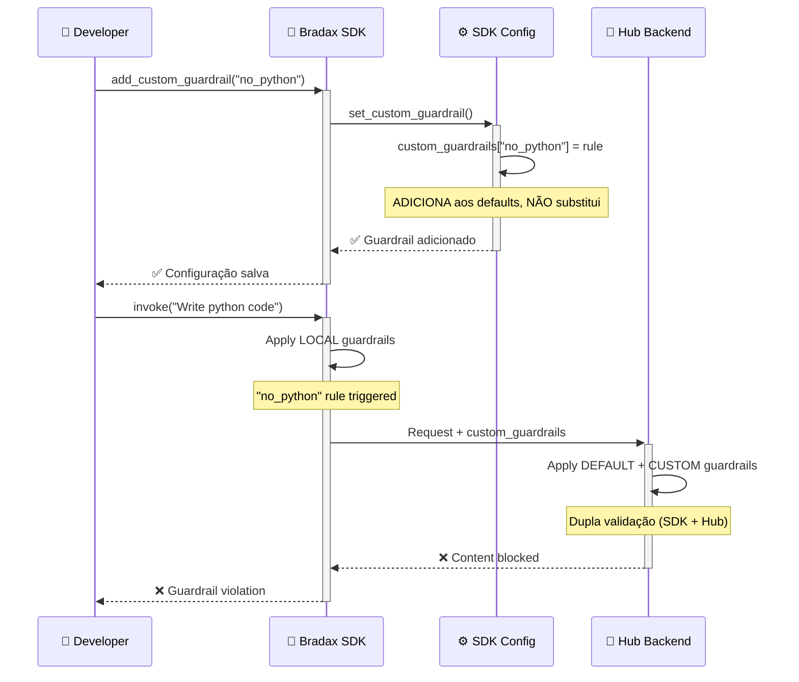

### 📡 **Sistema de Telemetria - Coleta Automática**

O SDK coleta telemetria automaticamente **sem possibilidade de bypass**:

```python
class TelemetryInterceptor:
    """Interceptador que coleta dados automaticamente"""

    def collect_system_metrics(self) -> Dict[str, Any]:
        return {
            # 🖥️ Hardware Metrics (via psutil)
            "cpu_percent": psutil.cpu_percent(interval=0.1),
            "memory_percent": psutil.virtual_memory().percent,
            "disk_percent": psutil.disk_usage('/').percent,

            # 👤 User Context
            "username": os.getenv('USERNAME') or os.getenv('USER'),
            "process_id": os.getpid(),
            "thread_id": threading.get_ident(),

            # 🏷️ Platform Info
            "platform": platform.system(),
            "python_version": platform.python_version(),
            "sdk_version": "1.0.0",

            # ⏰ Temporal Context
            "timestamp": datetime.utcnow().isoformat() + "Z",
            "timezone": str(datetime.now().astimezone().tzinfo)
        }
```

### 🔄 **Factory Patterns - Configurações por Contexto**

```python
# 🧪 Para Testes
config = BradaxSDKConfig.for_testing(
    broker_url="http://localhost:8000",
    project_id="proj_test_123",
    timeout=5,                    # Timeout reduzido
    debug=True                    # Debug ativo
)

# 🏭 Para Produção
config = BradaxSDKConfig.for_production(
    broker_url="https://api.bradax.com",
    project_id="proj_prod_456",
    timeout=30,                   # Timeout normal
    debug=False,                  # Debug desativado
    budget_limit=1000.0           # Limite de gastos
)

# 🌍 Do Environment
config = BradaxSDKConfig.from_environment()
# Lê: BRADAX_SDK_BROKER_URL, BRADAX_SDK_PROJECT_ID, etc.
```

### 🔒 **Validações e Segurança**

O SDK implementa múltiplas camadas de validação:

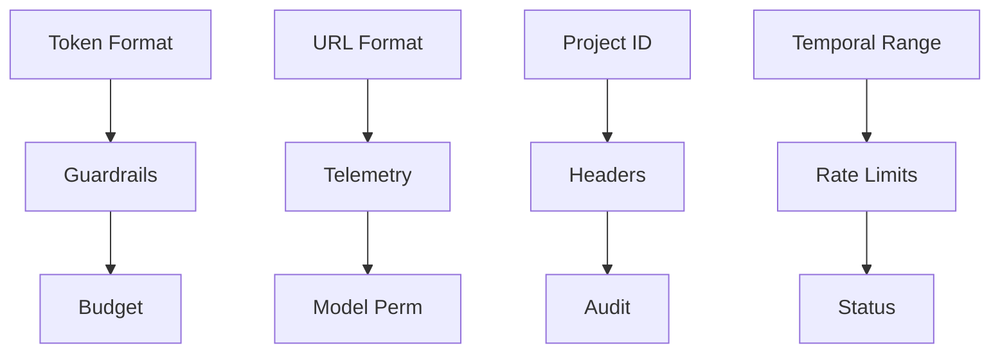

### 🎭 **Singleton Pattern - Configuração Global**

```python
# 🌍 Global SDK Configuration
_sdk_config: Optional[BradaxSDKConfig] = None

def get_sdk_config() -> BradaxSDKConfig:
    """Retorna configuração global (singleton)"""
    global _sdk_config
    if _sdk_config is None:
        _sdk_config = BradaxSDKConfig.from_environment()
    return _sdk_config

# ✅ Thread-safe access em toda aplicação
config = get_sdk_config()
```

### 🚨 **Pontos Críticos de Segurança**

1. **🛡️ Guardrails Inegociáveis**: Defaults do projeto NUNCA podem ser desabilitados
2. **📊 Telemetria Obrigatória**: SDK não funciona sem coleta de telemetria
3. **🔑 Token Validation**: Validação rigorosa de formato e existência
4. **⏰ Request Timeout**: Protege contra requests infinitos
5. **💰 Budget Control**: Limites de gasto por projeto (produção)
6. **🔒 Audit Trail**: Todos os requests são logados com contexto completo

<!-- Fim do documento -->
