<!-- README ≤ 140 linhas / Seção executiva ≤ 12 linhas -->
# Bradax Broker — Camada Corporativa de Governança LLM

> Plataforma que unifica acesso seguro a modelos generativos com: autenticação derivada por projeto, guardrails determinísticos em duas fases, telemetria estruturada e trilha de auditoria pronta para compliance.
> Foco: confiança, rastreabilidade, controle de custos e isolamento multi‑projeto.
> Zero dependência de serviços proprietários expostos nos documentos (abstração via *Provedor LLM*).
> SDK pronto para integração rápida (interface estilo cadeia de mensagens).
> Designed for: engenheiros sênior & decisores técnicos.

## 📌 Por que existe?

1. Eliminar risco de uso direto de modelos sem política corporativa.
2. Centralizar políticas (modelos permitidos, limites, guardrails) por projeto.
3. Tornar auditorável cada interação (camadas: request → guardrails → modelo → resposta).
4. Fornecer telemetria operacional e indicadores de custo/qualidade.
5. Acelerar onboarding de times internos com SDK único.

## 🚀 Valor Essencial (Narrativa Resumida)

| Pilar | O que entrega | Benefício executivo |
|-------|---------------|---------------------|
| Segurança | Assinatura derivada + headers mandatórios | Reduz superfície de vazamento |
| Conformidade | Guardrails determinísticos auditáveis | Evidências rápidas para auditorias |
| Observabilidade | Telemetria + eventos separados | Decisões orientadas a dados |
| Governança | Catálogo de modelos por projeto | Contenção de custo e risco |
| Extensibilidade | Arquitetura modular (services + middleware) | Evolução incremental controlada |

## 🏗️ Visão Macro (High-Level)

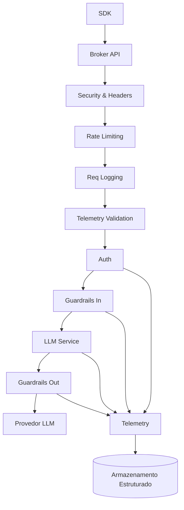

## 🔄 Sequência Resumida `/llm/invoke`

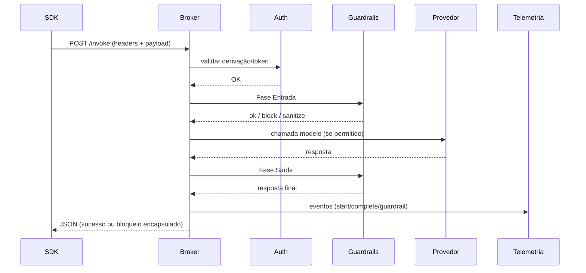

## 📂 Estrutura (Principais Diretórios)

```text
src/broker/
    api/ (rotas)          middleware/ (cadeia técnica)
    controllers/          services/ (llm, guardrails, telemetry)
    storage/ (json I/O)   utils/ (helpers transversais)
data/ (arquivos estado) tests/ (integração e2e) docs/ (arquitetura gerada)
```

## 🛡️ Guardrails em Duas Fases

- Entrada: normalização → match determinístico (regex/keywords) → ação (allow/sanitize/block)
- Saída: reavalia resposta do modelo (mesmo pipeline) antes do retorno.
- Customização via SDK (`custom_guardrails`) agregada ao conjunto padrão.
- Bloqueios retornam HTTP 200 com `success=false` (fail-soft) preservando rastreabilidade e evitando retry automáticos agressivos.

## 📊 Telemetria & Auditoria

- Arquivos independentes: `telemetry.json`, `guardrail_events.json`, `interactions.json`.
- Sem mistura de eventos: separação melhora consultas direcionadas.
- Headers obrigatórios + fingerprint → rejeição preventiva (middleware de validação).
- Roadmap: buffering e agregação estruturada.

## 🔐 Autenticação Derivada

- Segredo mestre + ID projeto → derivação determinística (não armazena segredo derivado).
- `kid` versionado (`v1`) embutido no token → prepara rotação futura.

## ⚙️ Modelo de Extensão

| Camada | Como estender |
|--------|---------------|
| Provider LLM | Novo adapter em `services/llm/providers.py` |
| Guardrail | Nova regra em `guardrails.json` (ou engine SDK) |
| Telemetria | Campos extras via metadata opcional |
| Auth | Nova estratégia de derivação versionada |

## 🧪 Testes E2E

- Servidor real + SDK → validação de bloqueio custom guardrail, regex inválida e fluxo permitido.
- Bloqueios geram artefatos raw correlacionados por `request_id`.

## 🧭 Roteiro Técnico Futuro (Resumo)

| Tema | Próximo passo |
|------|---------------|
| Multi‑provider | Adicionar registro dinâmico + seleção por política |
| Persistência | Evoluir de arquivos para storage indexado |
| Guardrails Contextuais | Habilitar análise semântica opcional |
| Telemetria | Agregação + exposição de métricas em endpoint |
| Rotação Segredos | Introduzir `kid=v2` + política de expiração |

## 📚 Documentação Detalhada

| Documento | Descrição |
|-----------|-----------|
| `docs/arquitetura.md` | Visão completa (componentes + decisões) |
| `docs/fluxos/invoke.md` | Profundidade do pipeline invoke |
| `docs/fluxos/guardrails.md` | Ciclo completo de regras |
| `docs/fluxos/telemetria.md` | Pipeline observabilidade |
| `docs/fluxos/auditoria.md` | Trilha e correlação de eventos |
| `docs/fluxos/governanca_modelos.md` | Políticas de modelo por projeto |
| `docs/fluxos/erros.md` | Taxonomia de erros e respostas |
| `docs/narrativa_valor.md` | Expansão da narrativa executiva |
| `docs/faq_arquitetural.md` | Perguntas frequentes técnicas |

## 🛠️ Execução Local Rápida

```bash
python -m venv .venv && source .venv/bin/activate  # ou equivalente Windows
pip install -r requirements.txt
export BRADAX_JWT_SECRET=changeme
python run.py
```

## 📄 Licença

Uso interno / confidencial – adaptar antes de abertura externa.

---
*Este README é um sumário executivo. Consulte a pasta `docs/` para profundidade técnica.*

## 📌 Estado de Implementação

| Área | Status | Notas |
|------|--------|-------|
| Autenticação JWT Multi-Projeto | Implementado | Derivação HMAC (kid v1) sem fallback |
| Emissão / Validação de Token | Implementado | `/api/v1/auth/token` / `/api/v1/auth/validate` |
| Guardrails Determinísticos | Implementado | Base `data/guardrails.json` (regex/keywords) |
| Guardrails com LLM | Roadmap | Placeholder de análise LLM não ativado |
| Telemetria básica (arquivos JSON) | Implementado | `telemetry.json`, `guardrail_events.json` |
| Métricas de Sistema (CPU/Mem/Disk) | Implementado | `/api/v1/metrics/system` |
| Métricas agregadas por projeto | Parcial | Agregação avançada ainda não exposta em endpoint dedicado |
| Projetos CRUD | Implementado | `/api/v1/projects/...` |
| Rate Limiting (in-memory) | Implementado | Middleware simples (por IP) |
| Segurança (headers) | Implementado | `SecurityMiddleware` |
| CORS Dinâmico | Implementado | Ativo somente em debug |
| Vector DB / Graph Execution | Roadmap | Apenas menções no código |
| Vault / Redis / Cache | Roadmap | TODO em `main.py` |
| Streaming LLM | Roadmap | API preparada para `operation=stream`, provider não implementado |
| Rotação de Segredos (kid v2) | Roadmap | Estratégia documentada; não implementada |
| Observabilidade avançada (Prometheus) | Roadmap | Ausente |

## 🧭 Mapa de Módulos → Seções do README

| Módulo / Arquivo | Responsabilidade Central | Seção de Referência |
|------------------|---------------------------|---------------------|
| `broker/main.py` | Criação da app, middlewares, rotas | Visão Arquitetural / Middlewares |
| `api/routes/auth.py` | Emissão e validação de tokens | Fluxo JWT |
| `api/routes/llm.py` | Endpoint unificado de invocação | Sequência /llm/invoke |
| `api/routes/projects.py` | CRUD de projetos | Endpoints / Projetos |
| `api/routes/system.py` | Info sistema / telemetria ingest | Telemetria Lifecycle |
| `api/routes/metrics.py` | Métricas de máquina | Métricas |
| `api/routes/health.py` | Health checks | Sistema / Health |
| `services/llm/service.py` | Orquestração de invoke LLM | Sequência /llm/invoke |
| `services/guardrails.py` | Aplicação das regras determinísticas | Pipeline Guardrails |
| `services/telemetry.py` | Registro de eventos estruturados | Telemetria Lifecycle |
| `middleware/security.py` | Headers de segurança | Segurança |
| `middleware/rate_limiting.py` | Controle de taxa in-memory | Rate Limiting |
| `middleware/logging.py` | Logs estruturados de request/response | Exemplo de Log |
| `middleware/telemetry_validation.py` | Validação payload telemetria | Telemetria Lifecycle |
| `data/projects.json` | Metadados de projetos/budget | Mapa de Dados |
| `data/guardrails.json` | Regras determinísticas centrais | Pipeline Guardrails |
| `data/telemetry.json` | Eventos de telemetria acumulados | Telemetria Lifecycle |
| `data/guardrail_events.json` | Eventos específicos de guardrails | Pipeline Guardrails |
| `data/llm_models.json` | Catálogo de modelos (permitidos) | Modelos |

## 🧱 Visão de Componentes (Detalhada)

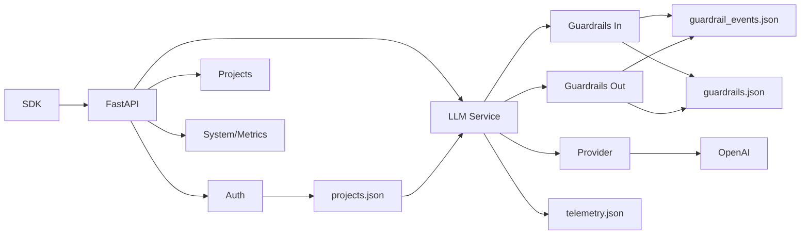

## 🔄 Sequência `/llm/invoke`

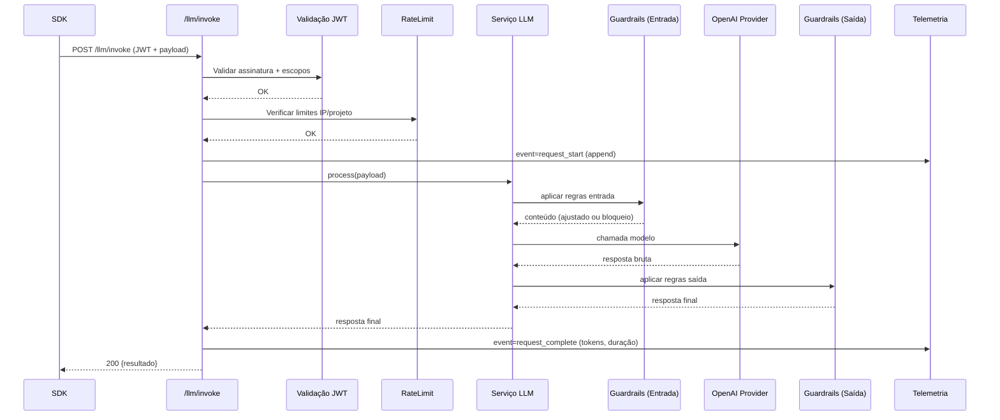

## 🧬 Ordem dos Middlewares (Execução)

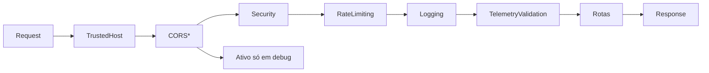

## 📤 Separação de Observabilidade

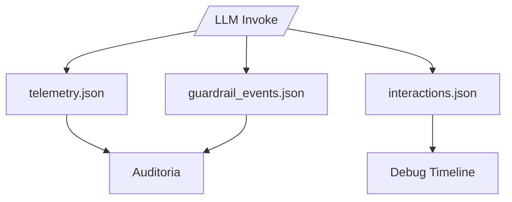

## 🛡️ Fases de Guardrails (Resumo)

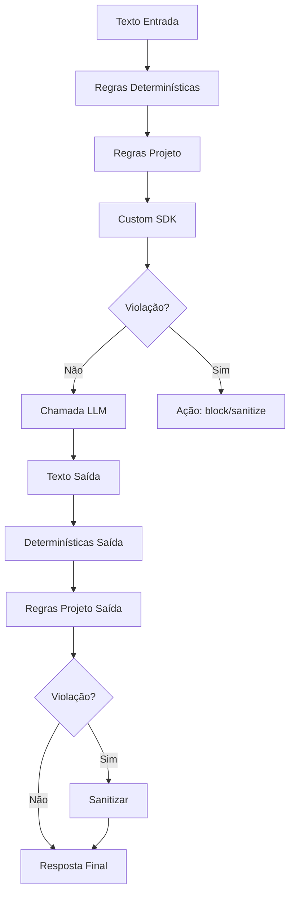

## 🚨 Caminhos de Falha (Fail-Fast)

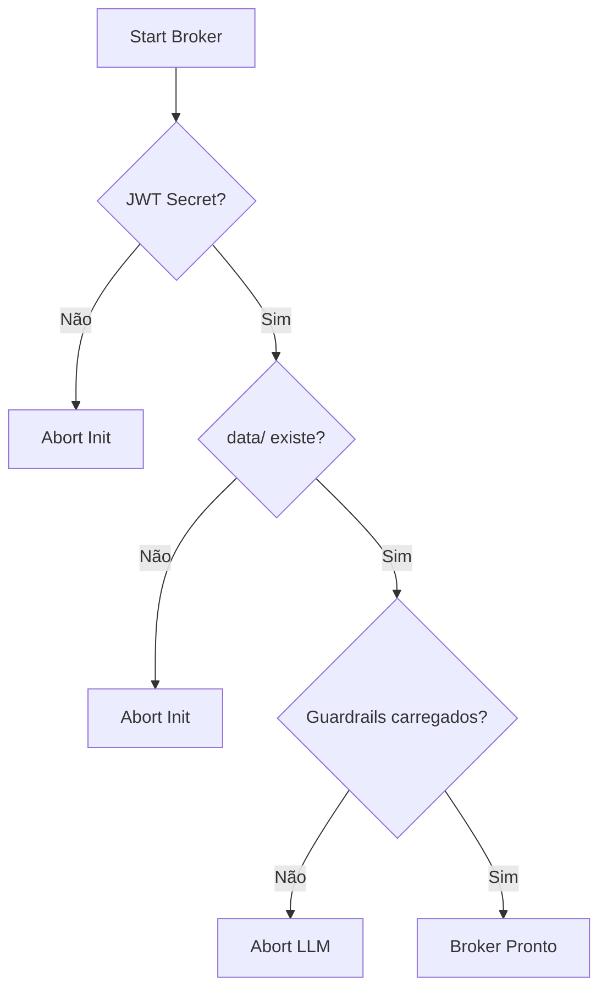

## 🗂️ Fluxo Persistência Simplificado

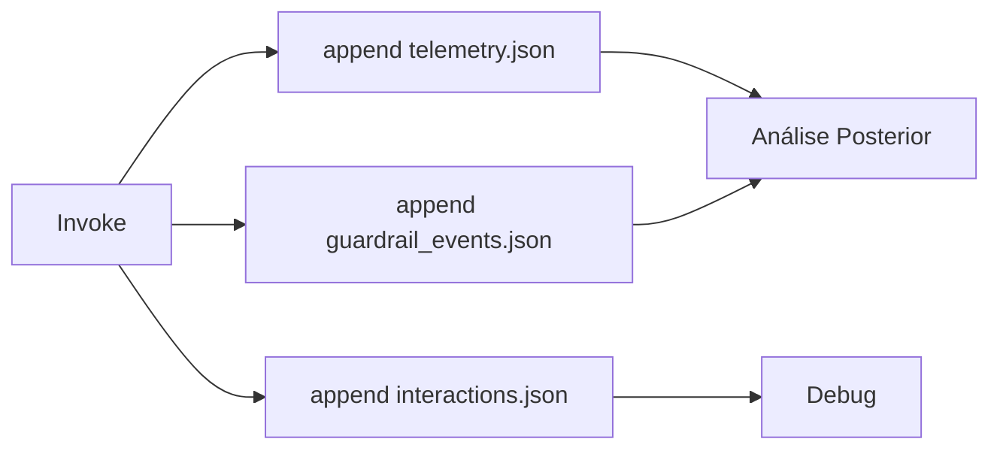

> Mais diagramas detalhados e decisões em `ARCHITECTURE_MEMORY.md`.

## 🔐 Fluxo de Emissão & Validação JWT

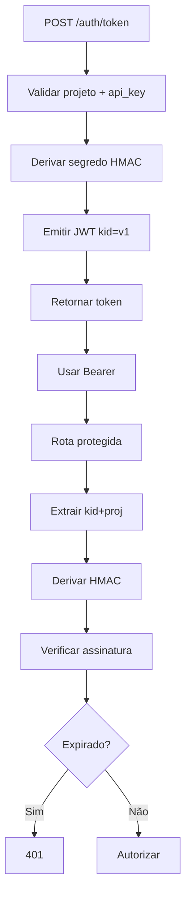

## 🛡️ Pipeline Guardrails

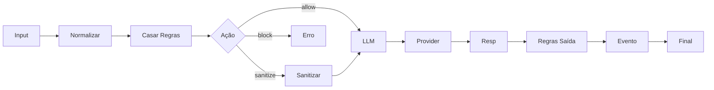

## 📡 Telemetria – Ciclo de Vida

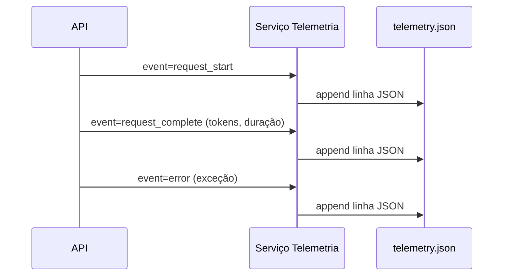

### 📌 Eventos e Campos (Implementação Real)

| Campo | Origem | Observação |
|-------|--------|------------|
| event_id | uuid4 | Sufixo `_complete` para conclusão |
| event_type | app | Valores: `request_start`, `request_complete`, `error`, `authentication` |
| project_id | request | Preenchido no start e erros; complete usa correlação indireta (todo) |
| endpoint/method | FastAPI scope | Apenas no start/auth |
| duration_ms | cálculo externo | Hoje depende de medição antes do record_complete (TODO centralizar) |
| model_used/tokens_consumed | LLM service | Só se disponível |
| cost_usd | LLM service | Placeholder; cálculo simples acumulável |
| guardrail_triggered | (deprecado) | Nunca mais setado (movido para `guardrail_events.json`) |
| metadata | chamador | Campos contextuais adicionais |

Persistência: cada chamada a `_add_event` faz flush imediato do arquivo `telemetry.json` (carrega, anexa e sobrescreve) garantindo durabilidade a custo de I/O elevado (roadmap: buffer + flush batch). Não há truncamento automático; limpeza futura via `cleanup_old_events()`.

### 🧮 Métricas Agregadas

`TelemetryCollector.get_project_metrics(project_id)` varre o arquivo completo e agrega:
`total_requests`, `total_errors`, `total_tokens`, `total_cost_usd`, `avg_response_time_ms`, `models_used`, `error_rate`. Guardrails não mais contam porque evento específico foi separado. O campo `project_id` nos eventos `request_complete` ainda não é preenchido (TODO: correlacionar pelo id base).

### 🔐 Middleware de Validação de Telemetria

`TelemetryValidationMiddleware` bloqueia (`403`) qualquer request aos endpoints críticos sem os headers obrigatórios (lista `x-bradax-*`), valida prefixo de `User-Agent` (`bradax-sdk/`), e impõe formato de fingerprint de máquina. Tentativa de bypass gera log `TELEMETRY_BYPASS_ATTEMPT` (roadmap: alertas SOC). Não lê o corpo para evitar consumir stream.

### 🔄 Interactions Tracking

Arquivo `interactions.json` registra estágios detalhados por `append_interaction_stage()` com campos: `stage`, `summary`, `result` (ex: pass, block), `guardrail_type`, `action`, `metadata`. Eventos "pass" são ignorados por padrão para reduzir ruído (`INTERACTIONS_LOG_PASS_EVENTS=False`). Capado a 5000 entradas (janela deslizante). Uso: auditoria forense de pipeline LLM.

### 🧷 Guardrail Events (Separação)

Eventos de bloqueio/sanitização não vão mais para `telemetry.json`. Arquivo dedicado `guardrail_events.json` evita duplicação e facilita queries de segurança. Método `TelemetryCollector.record_guardrail_trigger` hoje apenas loga e retorna (compatibilidade).

## 🗂️ Mapa de Dados Persistidos

| Arquivo | Produtor | Consumidor | Escrita | Formato | Observações |
|---------|----------|-----------|---------|---------|-------------|
| `projects.json` | CRUD projetos | Auth, LLM | Sobrescrita atômica | JSON objetos | Budget, allowed_models |
| `guardrails.json` | Manual | Guardrails Service | Leitura | JSON regras | Fonte única regras |
| `telemetry.json` | TelemetryService | Auditores/Futuro agregador | Append linha | JSON (linhas) | Eventos request/auth/error |
| `guardrail_events.json` | Guardrails Service | Auditores | Append linha | JSON (linhas) | Ações block/sanitize |
| `llm_models.json` | Manual | LLM Service | Leitura | JSON lista | Catálogo global |

## 🧪 Exemplo de Log Estruturado

```json
{
  "timestamp": "2025-08-19T12:34:56Z",
  "level": "INFO",
  "request_id": "req_01H92Z...",
  "route": "/api/v1/llm/invoke",
  "method": "POST",
  "project_id": "proj_real_001",
  "kid": "p:proj_real_001:v1",
  "signing_strategy": "derived_v1",
  "duration_ms": 842,
  "status_code": 200,
  "tokens_used": 118,
  "model": "gpt-4.1-nano"
}
```

## 🚦 Rate Limiting (In-Memory)

- Chave: IP de origem (pode ser expandido para `IP+project_id` futuramente)
- Contadores: janela móvel simples (minuto/hora) + limite de concorrência
- Config: `BRADAX_RATE_LIMIT_RPM`, `BRADAX_RATE_LIMIT_RPH`, `BRADAX_MAX_CONCURRENT`
- Limitações: não distribuído, reinicia a cada restart
- Evolução: Redis + algoritmo token bucket consistente

## 🔑 Tabela Consolidada de Variáveis de Ambiente

| Variável | Obrigatória | Default | Descrição | Impacto |
|----------|-------------|---------|-----------|---------|
| `BRADAX_JWT_SECRET` | Sim | — | Segredo mestre derivação JWT | Segurança / Auth |
| `OPENAI_API_KEY` | Sim | — | Chave acesso OpenAI | LLM Provider |
| `BRADAX_ENV` | Não | development | Ambiente de execução | Comportamento CORS/log |
| `BRADAX_JWT_EXPIRE_MINUTES` | Não | 15 | Expiração dos tokens | Segurança sessão |
| `BRADAX_RATE_LIMIT_RPM` | Não | 60 | Requests por minuto/IP | Proteção abuso |
| `BRADAX_RATE_LIMIT_RPH` | Não | 1000 | Requests por hora/IP | Proteção abuso |
| `BRADAX_MAX_CONCURRENT` | Não | 10 | Requisições simultâneas | Estabilidade |
| `BRADAX_HUB_LLM_TIMEOUT` | Não | 180 | Timeout chamadas LLM (s) | Resiliência |

## 🗺️ Roadmap Visual Simplificado

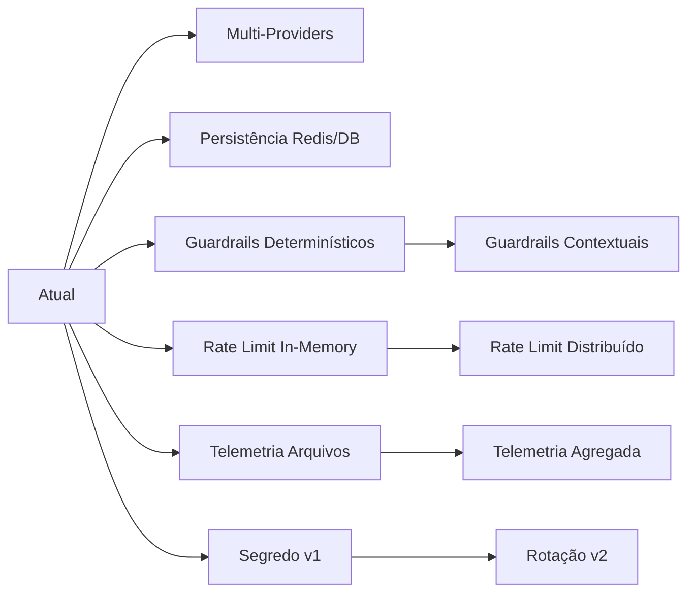

## 🎯 Casos de Uso

### 1. Interface LangChain Padronizada

```python
# SDK LangChain-compatível se autentica com broker
config = BradaxSDKConfig.for_development(
    broker_url="http://localhost:8000",
    project_id="acme-ai-assistant"
)
client = BradaxClient(config)

# Interface LangChain padrão
response = client.invoke("Analise este documento corporativo...")
print(response["content"])
```

### 2. Guardrails Automáticos por Projeto

```python
# Política aplicada automaticamente por projeto
{
    "content_filters": ["pii", "confidential"],
    "max_tokens": 2000,
    "allowed_domains": ["empresa.com"],
    "compliance": "LGPD"
}
```

### 3. Telemetria e Auditoria

```python
# Coleta automática de métricas
{
    "request_id": "req_789xyz",
    "project": "acme_ai_assistant",
    "model": "gpt-4o-mini",
    "tokens_used": 1250,
    "cost": 0.15,
    "timestamp": "2025-07-29T01:15:30Z",
    "user_department": "marketing"
}
```

## ⚙️ Configuração de Environment

### Variáveis Obrigatórias

```bash
# JWT Secret (OBRIGATÓRIO para segurança)
export BRADAX_JWT_SECRET="$(openssl rand -base64 32)"

# OpenAI API Key (OBRIGATÓRIO para LLM)
export OPENAI_API_KEY="sk-your-openai-key-here"
```

### Variáveis Opcionais

```bash
# Environment
export BRADAX_ENV="production"  # development|testing|staging|production

# JWT Configuration
export BRADAX_JWT_EXPIRE_MINUTES="15"  # Token expiration (default: 15min)

# Rate Limiting
export BRADAX_RATE_LIMIT_RPM="60"      # Requests per minute (default: 60)
export BRADAX_RATE_LIMIT_RPH="1000"    # Requests per hour (default: 1000)
export BRADAX_MAX_CONCURRENT="10"      # Max concurrent requests (default: 10)

# Network Timeouts
export BRADAX_HUB_LLM_TIMEOUT="180"    # LLM timeout in seconds (default: 180)
```

### Setup Rápido para Desenvolvimento

```bash
# Gerar JWT secret seguro
export BRADAX_JWT_SECRET="$(openssl rand -base64 32)"

# Configurar OpenAI
export OPENAI_API_KEY="sk-your-key-here"

# Executar broker
cd bradax-broker
python -m uvicorn broker.main:app --reload --port 8080
```

### Setup Produção (Exemplo Base)

```bash
# JWT secret gerado com alta entropia
export BRADAX_JWT_SECRET="$(openssl rand -base64 48)"

# Environment de produção
export BRADAX_ENV="production"

# Rate limiting mais restritivo
export BRADAX_RATE_LIMIT_RPM="30"
export BRADAX_MAX_CONCURRENT="5"

# Executar com bind específico
python -m uvicorn broker.main:app --host 0.0.0.0 --port 8080
```

## 🛠️ Endpoints Principais

### Autenticação

```http
POST /api/v1/auth/token        # Emissão de JWT (Bearer)
POST /api/v1/auth/validate     # Validação de JWT
```

Payload emissão:

```json
{
    "project_id": "proj_real_001",
    "api_key": "<api_key_do_projeto>"
}
```

Resposta (exemplo abreviado):

```json
{ "access_token": "<JWT>", "token_type": "Bearer", "expires_in": 900 }
```

### Projetos

```http
GET    /api/v1/projects/                # Lista
GET    /api/v1/projects/{project_id}    # Detalhe
POST   /api/v1/projects/                # Criação
PUT    /api/v1/projects/{project_id}    # Atualização
DELETE /api/v1/projects/{project_id}    # Remoção
GET    /api/v1/projects/{project_id}/health
```

### Operações LLM (invocação unificada)

```http
# Execução de modelo - Formato LangChain (padrão)
POST /api/v1/llm/invoke
{
    "operation": "chat",
    "model": "gpt-4o-mini",
    "payload": {
        "messages": [
            {"role": "user", "content": "Sua pergunta aqui"}
        ],
        "max_tokens": 1000,
        "temperature": 0.7
    },
    "project_id": "acme_ai_assistant"
}

# Formato legado simplificado (compatibilidade)
POST /api/v1/llm/invoke
{
    "operation": "chat",
    "model": "gpt-4o-mini",
    "payload": {
        "prompt": "Sua pergunta aqui",
        "max_tokens": 1000
    },
    "project_id": "acme_ai_assistant"
}

GET /api/v1/llm/models?project_id=acme_ai_assistant   # Modelos registrados
```

### Sistema / Health / Métricas

```http
GET /health                     # Health público básico
GET /api/v1/system/health       # Health interno
GET /api/v1/system/info         # Info sistema
GET /api/v1/metrics/system      # Métricas de CPU/Mem/Disk
POST /api/v1/system/telemetry   # Ingest de telemetria (SDK)
```

> Nota: Endpoints `/api/v1/system/metrics` e `GET /api/v1/system/telemetry` citados previamente foram **corrigidos** (não existem); o caminho válido de métricas de sistema é `/api/v1/metrics/system` e telemetria é somente `POST /api/v1/system/telemetry`.

## 🔐 Segurança e Autenticação

### Modelo de Autenticação

- **Multi-Projeto Derivado:** Segredo por projeto via HMAC de segredo mestre + namespace
- **Validação Contínua:** JWT verificado em cada requisição protegida
- **Escopo Projetado:** Payload contém `project_id`, `organization`, `scopes`

### Multi-Auth JWT Derivado por Projeto (v1)

A partir de 2025-08-19 o broker utiliza derivação determinística de segredo por projeto (sem fallback legacy):

```text
derived_secret = Base64Url( HMAC-SHA256( master_secret, "bradax-jwt-v1::" + project_id_lower ) )
```

O header do token contém `kid` no formato:

```json
{ "kid": "p:<project_id>:v1" }
```

Características:

- Segregação criptográfica entre projetos (um segredo derivado por `project_id`).
- Nenhum secret derivado armazenado; geração on-demand.
- Validação estrita de `kid` + consistência de `project_id`.
- Rotação planejada: adicionar `v2` mantendo formato `p:<project_id>:vN`.

Migração:

- Tokens anteriores à data de ativação (2025-08-19) **não** são aceitos (sem fallback).
- Gere novos tokens via `/api/v1/auth/token` ou script `scripts/get_token_and_invoke.py`.

Logs:

- Eventos `jwt_issue` / `jwt_validate` incluem `project_id`, `kid`, `signing_strategy=derived_v1` – sem vazamento de material sensível.

Segurança:

- Master secret apenas em memória de processo.
- Derivados não persistidos, reduzindo superfície de ataque.

## 🧪 Testes End-to-End Multi-Auth / SDK

Esta seção descreve como executar e validar o roteiro de testes oficial do recurso Multi-Auth (documento completo em `workspace-debug/bradax-auditoria-debug/roteiro-testes-multi-auth-sdk.md`).

### 1. Pré-Requisitos

1. Broker executando (ex: `python -m uvicorn broker.main:app --reload --port 8080`).
2. Variáveis exportadas: `BRADAX_JWT_SECRET`, `OPENAI_API_KEY`, `BRADAX_ENV=development`.
3. Projetos `proj_real_001` e `proj_real_002` presentes em `data/projects.json` com `budget_remaining`.

### 2. Emissão e Uso de Tokens

PowerShell (Windows):

```powershell
python scripts/get_token_and_invoke.py --project-id proj_real_001 --prompt "PING"
python scripts/get_token_and_invoke.py --project-id proj_real_002 --prompt "PING"
```

Verifique que cada saída exibe um JWT cujo header contém `kid=p:<project_id>:v1` e que as assinaturas (3º segmento) diferem entre os projetos.

### 3. Invocação Real via SDK

```powershell
python scripts/get_token_and_invoke.py --project-id proj_real_001 --prompt "Qual era o presidente do brasil em 2002?" --invoke
python scripts/get_token_and_invoke.py --project-id proj_real_002 --prompt "Qual era o presidente do brasil em 2002?" --invoke
```

Resultado esperado (ambos projetos): resposta mencionando "Fernando Henrique Cardoso"; log registra eventos `jwt_validate` e `llm_invoke` com `signing_strategy=derived_v1`.

### 4. Principais Casos (Resumo)

| ID | Objetivo | Resultado Esperado |
|----|----------|--------------------|
| T01/T02 | Emitir tokens A e B | `kid` distinto por projeto (v1) |
| T03 | Diferenciar assinaturas | Segmento de assinatura diferente |
| T04/T05 | Rejeição cruzada | 401 ao usar token A como B (e vice-versa) |
| T06/T07 | `validate_connection` | Retorno OK para ambos projetos |
| T08/T09 | `invoke` pergunta histórica | Resposta correta (FHC) |
| T10 | Log estratégia | `signing_strategy=derived_v1` presente |
| T11 | Vazamento de segredo | Nenhum trecho do master secret em logs |
| T13 | `kid` inválido | Rejeição imediata |
| T14 | Payload alterado | Assinatura inválida |

### 5. Testes Negativos Rápidos

Modificar manualmente o token para simular falhas:

```powershell
# Alterar 1 caractere no payload e tentar endpoint protegido -> 401 esperado
# Alterar kid para p:proj_real_001:v2 -> rejeição (versão desconhecida)
```

### 6. Auditoria de Logs

Buscar no arquivo `logs/bradax_broker_*.log`:

```powershell
Select-String -Path logs/bradax_broker_*.log -Pattern "jwt_issue","jwt_validate","signing_strategy=derived_v1"
```

Garantir ausência de qualquer substring significativa do valor real de `BRADAX_JWT_SECRET`.

### 7. Automação Futura

- Converter casos T01–T14 em testes `pytest` focando: derivação, parsing de `kid`, rejeições.
- Introduzir verificação de entropia mínima do master secret (≥ 32 chars) antes de iniciar.
- Adicionar cenário de rotação (futuro `v2`) usando mesmo formato de `kid`.

Para detalhes completos (passo a passo, riscos e evidências sintéticas) consulte o roteiro oficial.


### Headers Relevantes

```http
Authorization: Bearer <JWT_ASSINADO>
Content-Type: application/json
```
> Header `X-Project-Token` foi removido da documentação: não há uso no código atual.

### Middleware de Segurança

1. **SecurityMiddleware:** Headers de segurança (CSP básica, no-store) e saneamento simples
2. **RateLimitingMiddleware:** Limite por IP em memória (`requests_per_minute`)
3. **LoggingMiddleware:** Logs estruturados de requisições / respostas (sem payload sensível)
4. **TelemetryValidationMiddleware:** Validação de payload de telemetria recebido
5. **CORSMiddleware (dev):** Apenas em ambientes não-produção

Nota: Não há `AuthenticationMiddleware` dedicado; a validação JWT ocorre nas rotas (dependências FastAPI).

## 📊 Telemetria

### Coleta Automática

- **Requisições:** Todas as chamadas são registradas
- **Performance:** Latência, throughput, errors
- **Custos:** Tokens consumidos por projeto/modelo
- **Compliance:** Logs para auditoria corporativa

### Formato Real de Eventos (simplificado)

```json
{
    "event_id": "uuid",
    "timestamp": "2025-08-20T00:30:00Z",
    "project_id": "proj_real_001",
    "event_type": "request_start" | "request_complete" | "error" | "authentication",
    "endpoint": "/api/v1/llm/invoke",
    "status_code": 200,
    "model_used": "gpt-4.1-nano",
    "tokens_consumed": 120,
    "duration_ms": 850,
    "metadata": { }
}
```

> Amostras agregadas de custo/erro exibidas anteriormente foram marcadas como **roadmap** e removidas para evitar confusão.

## 🛡️ Guardrails

### Características Atuais

- Regras regex/keywords carregadas de `data/guardrails.json` (fonte única)
- Ações: flag / sanitize / block (dependendo da regra)
- Sem dependência de LLM para decisão (determinístico)
- Eventos de bloqueio e modificação registrados em `guardrail_events.json`
- Carregamento único via `data/guardrails.json` (fonte única). Regras desabilitadas são puladas.
- Combinação de regex: múltiplos padrões unidos por OR agregando `(pattern1)|(pattern2)`.
- Keywords = união de `keywords` explícitos + nomes de cada pattern para ampliar cobertura sem duplicar regex.
- `whitelist` aplicada por substring simples antes de registrar violação.
- Severidade mapeada (low/medium -> warning, high -> block, critical -> critical); action default = flag.
- Resultado agrega ação predominante: BLOCK > SANITIZE > FLAG > ALLOW.
- Sanitização: substituição case-insensitive por `[REDACTED]` para cada keyword ou regex.
- Fallback LLM: desativado por ausência de injeção (`llm_service=None`) (caminho futuro para análise contextual).

### Fluxo de Decisão (Detalhado)

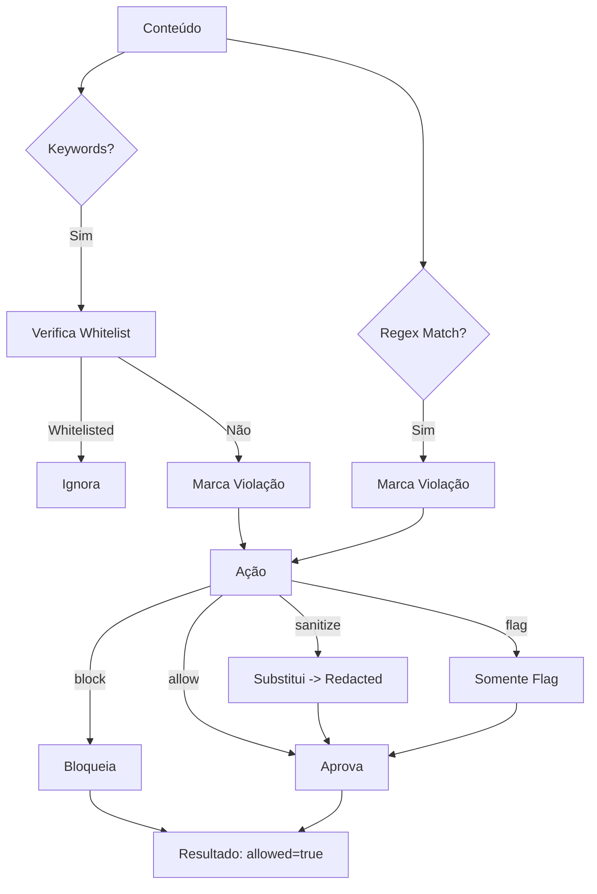

### Campos de Resultado

| Campo | Significado |
|-------|-------------|
| allowed | True se nenhuma regra com action BLOCK acionou |
| triggered_rules | IDs de regras acionadas |
| blocked_content | Lista textual de detalhes de violação (não conteúdo completo) |
| sanitized_content | Texto pós sanitização ou null |
| action | ALLOW / FLAG / SANITIZE / BLOCK (predominante) |
| severity | Máxima severidade entre regras acionadas |
| reason | Texto de explicação resumida |
| metadata.total_rules_checked | Número de regras ativas avaliadas |

### 🤖 Análise LLM (Estado Atual)

O código do `GuardrailEngine` contém rotina opcional `_llm_content_analysis` chamada somente se `self.llm_service` estiver configurado **e** a categoria da regra estiver em `content_safety|business|compliance`. No bootstrap atual `self.llm_service = None`, portanto:

- Nenhuma chamada de análise contextual LLM é feita hoje.
- Decisões são 100% determinísticas (regex/keywords/whitelist).
- Blocos de código relacionados a LLM fazem early return (`{"available": False, "violation": False}`).

Como habilitar futuramente (roadmap): injetar instância de `LLMService` após criação do engine e garantir modelos de análise dedicados para custo controlado. Lógica existente já contempla override de falsos positivos e reforço para violações de alta confiança (>0.7) se o LLM estiver ativo.

### Roadmap Guardrails

- Análise contextual via LLM (camada opcional)
- Console administrativo para alteração dinâmica
- Versionamento de regras com rollback

### Exemplo Conceitual Futuro (config por projeto – ainda não exposto via API)

```json
{
    "guardrails": {
        "content_policy": {
            "filter_pii": true,
            "filter_confidential": true,
            "max_content_length": 10000
        },
        "usage_limits": {
            "max_tokens_per_day": 100000,
            "max_requests_per_minute": 50,
            "max_cost_per_month": 1000.00
        },
        "compliance": {
            "data_residency": "BR",
            "audit_level": "full",
            "retention_days": 90
        }
    }
}
```

## 🔧 Integração com LangChain

### Modelos / Providers

Modelos atualmente listados nas constantes (`SUPPORTED_MODELS`):

```text
gpt-4.1-nano | gpt-4.1-mini | gpt-4.1 | gpt-4o-mini | gpt-4o
```

Provider ativo implementado: **OpenAI** (via `langchain_openai.ChatOpenAI`). Modelo padrão atual: `gpt-4.1-nano` (override por `model` no payload se suportado).

Roadmap: Anthropic (Claude), Google (Gemini).

### Configuração de Modelos

```python
# Configuração no projeto
{
    "allowed_models": [
        {
            "model_id": "gpt-4o-mini",
            "max_tokens": 4096,
            "cost_per_token": 0.00015,
            "enabled": true
        }
    ]
}
```

## 📈 Monitoramento e Observabilidade

### Health Checks

```http
GET /health
{
    "status": "healthy",
    "timestamp": "2025-07-29T01:15:30Z",
    "services": {
        "llm_service": "up",
        "storage": "up",
        "auth": "up"
    }
}
```

### Logs Estruturados

```json
{
    "timestamp": "2025-07-29T01:15:30Z",
    "level": "INFO",
    "service": "llm_controller",
    "request_id": "req_789xyz",
    "project_id": "acme_ai_assistant",
    "action": "llm_invoke",
    "model": "gpt-4o-mini",
    "tokens": 1250,
    "latency_ms": 850,
    "status": "success"
}
```

## 🚀 Integração SDK-Broker

### 1. Configuração e Uso Básico

```python
from bradax import BradaxClient
from bradax.config import BradaxSDKConfig

config = BradaxSDKConfig.for_integration_tests(
    broker_url="http://localhost:8080",
    project_id="proj_real_001",
    api_key="<api_key_projeto>"
)

client = BradaxClient(config)
response = client.invoke("Analise este documento...")
print(response["content"])
```

### 2. Processamento com Mensagens Estruturadas

```python
# Formato LangChain com roles
messages = [
    {"role": "system", "content": "Você é um assistente especializado"},
    {"role": "user", "content": "Resuma este relatório"}
]

response = client.invoke(messages, config={"model": "gpt-4o"})
```

### 3. Processamento Assíncrono (Exemplo)

```python
# Uso assíncrono para operações longas
async def process_document(text):
    response = await client.ainvoke(
        f"Analise este documento: {text}",
        config={"temperature": 0.1}
    )
    return response["content"]

# Exemplo (pseudo) de streaming
# async for chunk in client.stream("Pergunta", config={"model": "gpt-4o-mini"}):
#     print(chunk, end="")
```

### 4. Function Calling (SDK – Exemplo Conceitual)

```python
# Execução de funções
response = client.run_llm(
    prompt="Qual a previsão do tempo em São Paulo?",
    model="gpt-4o",
    functions=[{
        "name": "get_weather",
        "description": "Obter previsão do tempo",
        "parameters": {"city": "string"}
    }]
)
```

## 🔄 Arquitetura de Dados

### Fluxo de Dados

```text
Cliente → Auth → Guardrails → LLM → Provider → Response
    ↓        ↓         ↓        ↓
  Telemetria ← Storage ← Logs ← Metrics
```

### Persistência (Arquivos Ativos)

- `data/projects.json`
- `data/guardrails.json` & `data/guardrail_events.json`
- `data/telemetry.json`
- `data/interactions.json` (estágios detalhados de fluxo)
- `data/system_info.json`

## 🛣️ Roadmap Consolidado

| Item | Prioridade | Descrição |
|------|------------|-----------|
| Rotação JWT v2 | Alta | Introduzir versionamento e janela de coexistência |
| Métricas agregadas / dashboards | Alta | API para custos, tokens, erro por projeto |
| Guardrails contextuais LLM | Média | Análise semântica adicional (opt-in) |
| Vector DB & Graph Execution | Média | Execução de workflows e memória vetorial |
| Observabilidade Prometheus | Média | Exporter para scraping externo |
| Console Admin / UI | Baixa | Gerenciar projetos, guardrails e limites |
| Streaming e Batch | Baixa | Operações `stream` e `batch` reais |

---

> **Nota:** Este documento foi revisado para remover inconsistências (endpoints inexistentes, headers não usados, modelos não suportados) e alinhar totalmente com o estado atual do código.
