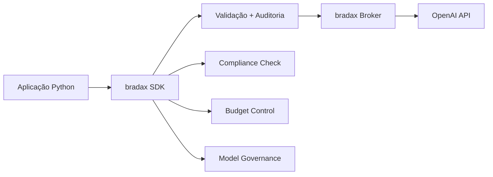

# bradax SDK - Cliente Corporativo Python

> **🏢 SDK Python oficial para integração corporativa com o bradax Broker**  
> Desenvolvido para ambientes empresariais com autenticação por projeto, auditoria completa e governança automática.

[](https://python.org/)
[](https://restapi.org/)
[](https://bradesco.com.br/)

## 📋 Visão Geral

O **bradax SDK** é o cliente Python oficial para integração com o bradax Broker, oferecendo:

- **🔐 Autenticação Corporativa**: Sistema de tokens por projeto
- **📊 Auditoria Automática**: Rastreamento completo de todas as operações
- **⚖️ Governança Integrada**: Controle de custos, modelos e compliance
- **🛡️ Exception Handling Robusto**: Sistema de exceções hierárquico enterprise-grade
- **📈 Monitoramento**: Métricas de performance e custos em tempo real

## 🚀 Instalação

### Instalação via Nexus (Recomendado)

```bash
# Configurar repositório corporativo (apenas primeira vez)
pip config set global.index-url https://nexus.bradesco.com.br/repository/pypi-group/simple/
pip config set global.trusted-host nexus.bradesco.com.br

# Instalar bradax SDK
pip install bradax-sdk
```

### Instalação Manual (Desenvolvimento)

```bash
git clone https://git.bradesco.com.br/ai/bradax-sdk.git
cd bradax-sdk
pip install -e .
```

## ⚡ Início Rápido

### 1. Configuração Básica

```python
from bradax import CorporateBradaxClient

# Cliente corporativo com autenticação por projeto
client = CorporateBradaxClient(
    project_token="proj_inovacao_ia_chatbot_2025_a1b2c3d4",
    broker_url="https://bradax.bradesco.com.br"
)
```

### 2. Primeira Invocação

```python
import asyncio

async def exemplo_basico():
    # Invocar LLM com governança automática
    response = await client.invoke_llm(
        model="gpt-4.1-nano",
        messages=[
            {"role": "user", "content": "Resuma os benefícios do Seguro Vida Bradesco"}
        ],
        parameters={"max_tokens": 500, "temperature": 0.3}
    )
    
    print(f"💬 Resposta: {response['choices'][0]['message']['content']}")
    print(f"💰 Custo: ${response['_bradax_metadata']['cost_usd']:.6f}")
    print(f"⚡ Latência: {response['_bradax_metadata']['latency_ms']}ms")

# Executar
asyncio.run(exemplo_basico())
```

### 3. Resultado com Auditoria

```
💬 Resposta: O Seguro Vida Bradesco oferece proteção financeira...
💰 Custo: $0.000025
⚡ Latência: 1247ms
🔍 AUDIT LOG: {"trace_id": "trace_20250727_154200_a1b2c3d4", "status": "completed"}
```

## 🏗️ Arquitetura



## 📝 Configuração de Projeto

### Formato do Token

```
proj_{divisao}_{equipe}_{projeto}_{ano}_{hash}
```

**Exemplo:**
```
proj_inovacao_ia_chatbot_2025_a1b2c3d4
```

### Configuração via Broker

O SDK carrega automaticamente as configurações do projeto via Broker:

```yaml
# Configuração automática via Broker API
budget_limit: 1000.00          # Orçamento mensal em USD
max_tokens_per_request: 4096   # Limite de tokens por request
max_requests_per_hour: 100     # Limite de requests por hora
allowed_models:                # Modelos permitidos
  - gpt-4.1-nano
  - gpt-4.1-mini
compliance:                    # Regras de compliance
  - lgpd
  - pii_detection
```

## 🔧 Uso Avançado

### Exception Handling Robusto

```python
from bradax import (
    BradaxAuthenticationError,
    BradaxConnectionError, 
    BradaxValidationError,
    BradaxTimeoutError
)

try:
    response = await client.invoke_llm(...)
except BradaxAuthenticationError as e:
    print(f"🚫 Erro de autenticação: {e.message}")
    print(f"🔍 Detalhes: {e.details}")
except BradaxValidationError as e:
    print(f"⚠️ Erro de validação: {e.message}")
    print(f"🎯 Campo inválido: {e.details.get('invalid_field')}")
except BradaxConnectionError as e:
    print(f"🌐 Erro de conexão: {e.message}")
    print(f"🔄 Tentativas: {e.details.get('retry_count')}")
```

### Monitoramento e Auditoria

```python
# Acessar auditoria detalhada
audit_log = client.auditor.errors_logged
for error in audit_log:
    print(f"🕒 {error['timestamp']}")
    print(f"🔍 Trace ID: {error['trace_id']}")
    print(f"❌ Erro: {error['error']['message']}")
```

### Compliance e Governança

```python
# O SDK automaticamente:
# ✅ Valida se modelo é permitido para o projeto
# ✅ Verifica limites de tokens e orçamento
# ✅ Escaneia conteúdo para PII/compliance
# ✅ Registra todas as operações para auditoria
# ✅ Falha rápido com exceções detalhadas (zero fallback)

response = await client.invoke_llm(
    model="gpt-4.1-nano",  # Validado contra lista permitida
    messages=[
        {"role": "user", "content": "Conteúdo sem PII"}  # Escaneado automaticamente
    ],
    parameters={"max_tokens": 500}  # Validado contra limite do projeto
)
```

## 🌍 Ambientes

### Desenvolvimento

```python
from bradax import create_client

client = create_client(
    project_token="proj_dev_test_sandbox_2025_testkey",
    environment="development"  # → http://localhost:8001
)
```

### Staging

```python
client = create_client(
    project_token="proj_qa_test_staging_2025_stgkey",
    environment="staging"  # → https://bradax-staging.bradesco.com.br
)
```

### Produção

```python
client = create_client(
    project_token="proj_inovacao_ia_chatbot_2025_prodkey",
    environment="production"  # → https://bradax.bradesco.com.br
)
```

## 📊 Monitoramento

### Métricas Disponíveis

```python
# Cada resposta inclui metadados completos
metadata = response['_bradax_metadata']

print(f"🆔 Trace ID: {metadata['trace_id']}")
print(f"💰 Custo: ${metadata['cost_usd']:.6f}")
print(f"⚡ Latência: {metadata['latency_ms']}ms")
print(f"✅ Compliance: {metadata['compliance_check']}")
```

### Auditoria Corporativa

```python
# Logs automáticos para sistemas de monitoramento
# 🔍 Request logs: modelo, parâmetros, hash do prompt
# ✅ Response logs: tokens usados, custo, latência
# 🚨 Error logs: contexto completo, trace IDs
# 📊 Compliance logs: flags de PII, validações
```

## 📚 Exemplos Completos

### Chatbot Corporativo

```python
async def chatbot_corporativo():
    client = CorporateBradaxClient(
        project_token="proj_atendimento_chatbot_seguros_2025_abc123",
        broker_url="https://bradax.bradesco.com.br"
    )
    
    while True:
        pergunta = input("Cliente: ")
        
        try:
            response = await client.invoke_llm(
                model="gpt-4.1-nano",
                messages=[
                    {"role": "system", "content": "Você é um assistente especializado em seguros Bradesco."},
                    {"role": "user", "content": pergunta}
                ],
                parameters={"max_tokens": 300, "temperature": 0.2}
            )
            
            print(f"Assistente: {response['choices'][0]['message']['content']}")
            
        except Exception as e:
            print(f"Erro: {e}")
```

### Análise de Documentos

```python
async def analisar_documento():
    with open("contrato_seguro.txt", "r") as f:
        documento = f.read()
    
    response = await client.invoke_llm(
        model="gpt-4.1-mini",
        messages=[
            {"role": "user", "content": f"Analise este contrato e extraia os principais pontos: {documento}"}
        ],
        parameters={"max_tokens": 1000}
    )
    
    analise = response['choices'][0]['message']['content']
    custo = response['_bradax_metadata']['cost_usd']
    
    print(f"📄 Análise: {analise}")
    print(f"💰 Custo da análise: ${custo:.6f}")
```

## 🛠️ Desenvolvimento

### Estrutura do Projeto

```
bradax-sdk/
├── src/bradax/
│   ├── __init__.py              # Exports principais
│   └── corporate_client.py      # Cliente corporativo
├── examples/                    # Exemplos de uso
├── tests/                       # Testes unitários
├── pyproject.toml              # Configuração pip
└── README.md                   # Esta documentação
```

### Executar Testes

```bash
# Instalar dependências de desenvolvimento
pip install -e ".[dev]"

# Executar testes
pytest tests/ -v

# Executar com cobertura
pytest tests/ --cov=src --cov-report=html
```

## 🔐 Segurança

### Tokens de Projeto

- **✅ Formato validado**: `proj_{divisao}_{equipe}_{projeto}_{ano}_{hash}`
- **✅ Autenticação por projeto**: Cada token tem escopo limitado
- **✅ Rotação automática**: Tokens expiram conforme política corporativa
- **✅ Auditoria completa**: Todos os usos são rastreados

### Dados Sensíveis

- **✅ Detecção PII**: Scanner automático de dados pessoais
- **✅ Compliance LGPD**: Validação automática de conformidade
- **✅ Zero logs de conteúdo**: Apenas hashes para auditoria
- **✅ Criptografia em trânsito**: TLS 1.3 obrigatório

## 📞 Suporte

### Canais Oficiais

- **🎫 Service Now**: Abrir ticket na categoria "AI Generativa"
- **📧 Email**: ai-generativa@bradesco.com.br
- **📱 Teams**: Canal "AI Generativa - Suporte"

### Troubleshooting

#### Erro de Autenticação

```python
# ❌ Token inválido
BradaxAuthenticationError: "Token deve começar com 'proj_'"

# ✅ Solução: Verificar formato do token
# proj_{divisao}_{equipe}_{projeto}_{ano}_{hash}
```

#### Erro de Conexão

```python
# ❌ Broker indisponível  
BradaxConnectionError: "Não foi possível conectar ao broker"

# ✅ Solução: Verificar URL do broker e conectividade
```

#### Limite Excedido

```python
# ❌ Orçamento esgotado
BradaxValidationError: "Custo estimado excede orçamento mensal"

# ✅ Solução: Aguardar próximo mês ou solicitar aumento de budget
```

## 📜 Licença

**Uso Corporativo Interno - Bradesco Seguros**

Este SDK é propriedade exclusiva do Bradesco Seguros e destina-se apenas ao uso interno corporativo. Redistribuição ou uso externo não autorizado é proibido.

---

## 🚀 Conclusão

O **bradax SDK** oferece integração empresarial robusta com:

- **🔐 Autenticação segura** por projeto
- **📊 Auditoria completa** de todas as operações  
- **⚖️ Governança automática** de custos e compliance
- **🛡️ Exception handling** enterprise-grade
- **📈 Monitoramento** em tempo real

**Pronto para usar em produção** com zero configuração adicional.

---
*Documentação atualizada em: 27/07/2025*
