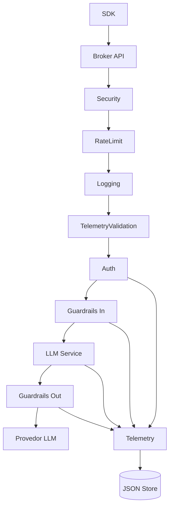
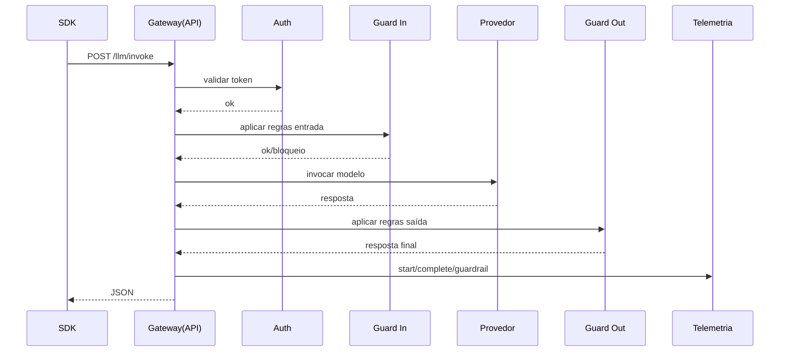
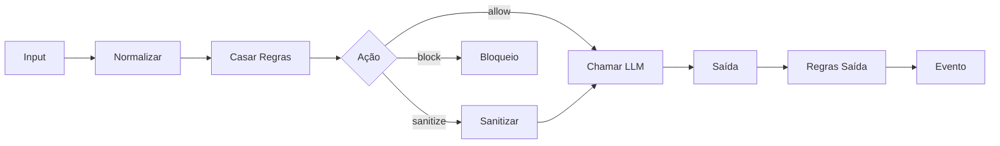
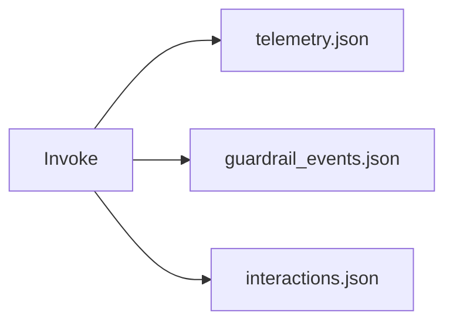
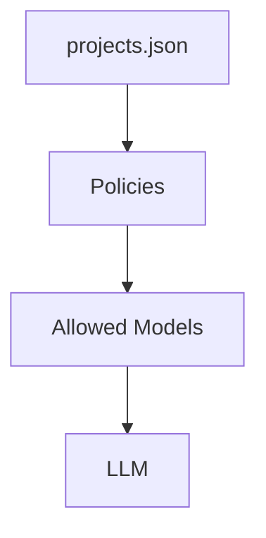
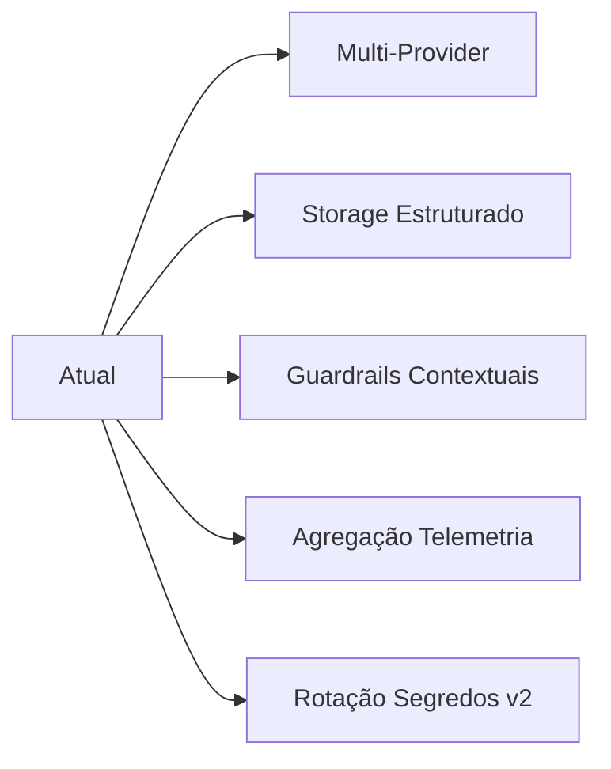

# Arquitetura Técnica Bradax

## 1. Visão Geral
Plataforma de governança para operações LLM: autenticação derivada por projeto, guardrails determinísticos bi‑fase, telemetria e auditoria segregadas. Base atual: armazenamento em arquivos JSON atômicos.

## 2. Componentes
| Camada | Papel | Observações |
|--------|-------|-------------|
| API (FastAPI) | Entrada unificada | Rotas versão v1 |
| Middleware | Barreiras transversais | Ordem determinística |
| Auth | Derivação + validação tokens | kid versionado |
| Guardrails Engine | Avaliação determinística | Custom SDK + padrão |
| LLM Service | Orquestração provider | Fail-soft guardrails |
| Telemetry | Persistência eventos | Flush imediato |
| Storage | I/O JSON atômico | Sem locking distribuído |

## 3. Pipeline Invoke (Detalhe)

## 4. Guardrails

Custom SDK: agregadas ao pipeline entrada. Fail-soft: bloqueio encapsulado (`success=false`).

## 5. Telemetria & Auditoria

- `telemetry.json`: request_start / request_complete / error / authentication
- `guardrail_events.json`: ações block/sanitize
- `interactions.json`: estágios detalhados (janela limitada)

## 6. Governança de Modelos

Bloqueio antecipado quando modelo não permitido.

## 7. Taxonomia de Erros
| Categoria | Origem | Exemplo | Tratamento |
|-----------|--------|---------|------------|
| Config | Falta de variável | Segredo ausente | Abort init |
| Auth | Token inválido | Assinatura incorreta | 401/403 |
| Guardrail | Violação determinística | Regex match sensível | 200 success=false |
| Provider | Erro externo | 4xx/5xx remoto | 200 success=false + log raw |
| Interno | Exceção não prevista | Trace genérico | 500 |

## 8. Riscos & Mitigações
| Risco | Impacto | Mitigação | Próximo Passo |
|-------|---------|----------|---------------|
### Matriz Ampliada

| Risco | Impacto | Probabilidade | Severidade | Mitigação Atual | Próximo Passo |
|-------|---------|--------------|-----------|-----------------|---------------|
| Armazenamento JSON único | Corrupção total / perda | Média | Alta | Fail-fast startup | Rotação + snapshots incrementais |
| Falta de versionamento de regras | Rollback lento / risco segurança | Alta | Média | Edição manual controlada | Snapshots + diff e rollback |
| Regex complexas | Latência crescente / CPU spike | Média | Média | Logs de aviso | Benchmark + limites + métricas |
| Ausência de interaction_id | Baixa rastreabilidade | Alta | Alta | Planejado | Introduzir UUID v7 + correlation_id |
| Fail-soft universal | Bloqueios ignorados por clientes | Média | Alta | Telemetria de violações | Modo fail-closed por política |
| Sem assinatura eventos | Integridade questionável | Média | Alta | Planejamento | Hash linha + HMAC + verificador |
| Dependência I/O síncrono | Picos de latência | Alta | Média | Simplicidade | Buffer em memória + flush intervalado |
| Ausência catálogo modelos | Governança limitada | Alta | Média | Abstração básica | Catálogo + Policy DSL |
| Falta de budget guard | Custo descontrolado | Média | Alta | N/A | Monitor tokens + limites |
| Sem classificação padrão de erros | Tratamento inconsistente | Média | Média | README parcial | Taxonomia + error_code |
| Faltam testes performance | Regressões invisíveis | Alta | Média | Testes integração | Benchmark automatizado |
| Não há anonimização PII | Possível vazamento audit | Baixa | Alta | Guardrails regex | Anonimizador / sanitizer dedicado |

> Critérios: Probabilidade e Severidade qualitativas para priorização.

## 9. Evolução

## 10. FAQ (Resumo)
| Pergunta | Resposta Curta |
|----------|----------------|
| Como sei se foi bloqueado? | success=false + model_used=guardrail_blocked |
| Por que 200 em erro guardrail? | Fail-soft p/ UX e evitar retries agressivos |
| Posso adicionar regra custom? | Via SDK custom_guardrails |
| Onde vejo bloqueios? | guardrail_events.json |
| Onde correlaciono fases? | interactions.json por request_id |
| Como expandir providers? | Implementar adapter + registrar |
| Modelo não permitido? | Retorna bloqueio antes da chamada |
| Métricas agregadas? | Função em TelemetryCollector (varredura) |
| Regras LLM ativas? | Não, pipeline determinístico apenas |
| Próxima grande mudança? | Rotação de segredos + multi-provider |

---
*Documento gera base técnica detalhada. Complementos em `docs/fluxos/`.*
