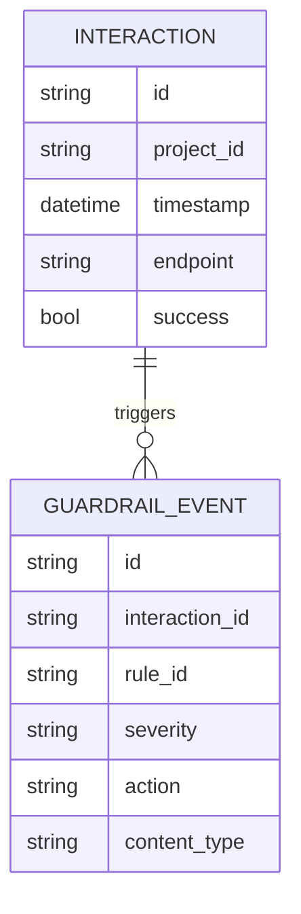

# Fluxo de Auditoria (Raw Events)

## 🎯 Objetivo
Descrever como eventos de guardrails, interações e (futuro) métricas de modelo podem ser correlacionados para auditoria operacional.

## 🔗 Relação com Telemetria
A auditoria reutiliza os mesmos arquivos base de telemetria (single-source-of-truth) adicionando camadas de correlação e enriquecimento.

## 🧬 Modelo Conceitual Simplificado


## 🔁 Pipeline Atual
1. Interaction inicia (middleware) → ID lógico implícito (pode ser derivado de timestamp + hash)
2. Guardrail trigger gera evento independente sem chave estrangeira forte (lacuna atual)
3. Interaction finaliza com status (blocked/allowed)
4. Auditoria offline pode correlacionar por (timestamp ± janela, project_id, endpoint)

## ⚠️ Lacunas Identificadas
| Área | Problema | Impacto |
|------|----------|---------|
| Chave correlação | Falta interaction_id persistido em guardrail_event | Dificulta rastreio 1:N |
| Integridade | Regravação de arquivo inteiro | Risco de corrupção total |
| Assinatura | Sem hash por evento | Não repudiation fraca |
| Rotação | Arquivos crescem indefinidamente | Risco I/O / análise lenta |

## 🛠️ Mitigações Planejadas
| Item | Abordagem | Prioridade |
|------|-----------|------------|
| interaction_id global | UUID v7 por requisição | Alta |
| Link explícito guardrail_event | Incluir interaction_id | Alta |
| Append seguro | Write-ahead log + compact | Média |
| Assinatura evento | SHA256 + HMAC chave rotacionável | Média |
| Rotação | daily rollover + compress | Alta |

## 🔍 Consulta Offline (Pseudo)
```python
# Carregar dados e correlacionar violações por projeto
def load_json(path):
    import json, pathlib
    with open(path, 'r', encoding='utf-8') as f:
        return json.load(f)

interactions = load_json('data/interactions.json')
violations = load_json('data/guardrail_events.json')

index = {}
for itx in interactions:
    key = (itx['project_id'], itx['endpoint'])
    index.setdefault(key, []).append(itx)

for ev in violations:
    # Estratégia simplista de match temporal
    pass
```

## 🧭 Roadmap Evolutivo Auditoria
| Item | Descrição | Valor |
|------|-----------|-------|
| Correlation Layer | interaction_id + event linking | Observabilidade |
| Timeline Builder | Reconstrução de sessão | Investigação |
| Export Normalizado | Formato parquet/arrow | Analytics |
| Motor de Consultas | Filtros + agregações | Velocidade |
| Retenção Configurável | TTL por tipo de evento | Conformidade |

## ✅ Critérios de Qualidade Futuro
- 100% eventos de guardrail possuem interaction_id
- Reconstrução de timeline com ordenação estável
- Integridade detecta corrupção parcial

---
*Documento gerado automaticamente (fluxo auditoria)*
