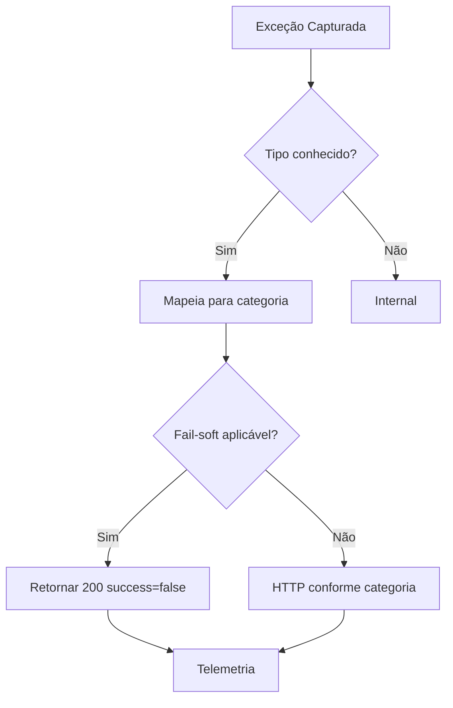

# Tratamento e Classificação de Erros

## 🎯 Objetivo
Catalogar tipos de erro, responsabilidade de tratamento e recomendações de resposta cliente.

## 🧾 Taxonomia
| Categoria | Exemplo Classe | Responsável | Deve Retentar | HTTP (atual) | Ação Cliente |
|-----------|----------------|-------------|---------------|--------------|--------------|
| Validation | ValidationException | Cliente corrige input | Não | 400/200 fail-soft | Ajustar dados |
| Configuration | ConfigurationException | Operação | Não (corrigir infra) | 500 | Abrir chamado ops |
| Business | BusinessException | Domínio | Dependente | 422/200 fail-soft | Corrigir regra negócio |
| Auth | AuthException (futuro) | Cliente credencial | Possível após renovar | 401/403 | Renovar secret |
| RateLimit | RateLimitException (futuro) | Cliente | Após backoff | 429 | Retry exponencial |
| Provider | ProviderException | Externo/proxy | Sim (jitter) | 502/503 | Retry com limite |
| Timeout | TimeoutException | Rede/externo | Sim (curto) | 504 | Retry breve |
| Internal | RuntimeError não mapeado | Equipe | Não | 500 | Reportar |

## 🔁 Fluxo de Mapeamento

## 🧪 Fail-Soft Aplicado
Atualmente usado para bloqueios de guardrail e algumas validações de conteúdo: retorna 200 com `success=false` e razão estruturada.

## 🛡️ Diretrizes de Design
- Não mascarar erros de configuração crítica
- Preferir códigos explícitos fora de escopo guardrails
- Incluir `error_code` estável no payload (roadmap)

## 🔐 Segurança
Evitar vazar detalhes de stack/provider no payload; logs detalhados permanecem internos.

## 🧭 Roadmap
| Item | Descrição | Prioridade |
|------|-----------|------------|
| error_code padronizado | Lista enumerada por categoria | Alta |
| envelope erro | { code, message, retryable } | Alta |
| tabela mapeamento | Automação doc a partir de código | Média |
| correlation_id | Traçar cadeia de chamadas | Alta |

## ✅ Critérios Futuro
- 100% erros retornam `error_code`
- Documentação geração automática
- Cliente decide retry deterministicamente

---
*Documento gerado automaticamente (tratamento de erros)*
