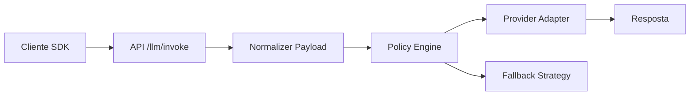
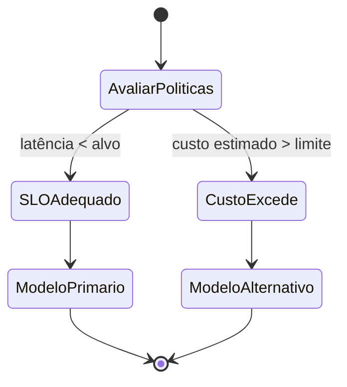

# Governança de Modelos

## 🎯 Objetivo
Definir princípios e mecanismos (atuais e futuros) para seleção, abstração, rotação e observabilidade de modelos LLM dentro do Hub sem expor detalhes de provedores.

## 📐 Princípios
- Abstração uniforme de invoke (payload padronizado)
- Neutralidade de fornecedor (evitar lock-in)
- Observabilidade comparável (latência, tokens, violações)
- Evolução incremental (feature flags / capability map)
- Segurança por design (nunca bypass de guardrails)

## 🧱 Camadas

- Normalizer: converte request SDK para formato interno
- Policy Engine (futuro): escolhe modelo com base em política declarativa
- Provider Adapter: camada fina; 1 adapter por provedor
- Fallback Strategy: rotas alternativas em caso de erro (ex: degradar para modelo resiliente)

## 🧪 Seleção de Modelo (Futuro Declarativo)

Critérios possíveis:
- performance.latency_p95 < threshold
- custo.token_in + token_out < budget
- compliance.regiao == "permitida"
- confiabilidade.taxa_erro_5m < limite

## 📊 Métricas Aspiradas
| Métrica | Uso | Fonte |
|---------|-----|-------|
| latency_p95_por_modelo | Decisão de rotação | interactions.json (futuro: enriched) |
| taxa_erro_modelo | Fallback automático | telemetry.json |
| custo_estimado | Orçamento mensal | payload tokens (futuro) |
| taxa_bloqueio_guardrails | Ajuste prompt templates | guardrail_events.json |

## 🔐 Política de Acesso
- Apenas modelos registrados em catálogo interno
- Versionamento lógico (model_alias → provider_model_id@rev)
- Decomissionamento com período de soak test

## 🔁 Rotação de Modelos (Blueprint)
1. Introdução em modo canário (5%)
2. Comparação métricas vs baseline
3. Escalonar para 25%, 50%, 100%
4. Desativar modelo legado após janela de rollback definida

## 🧭 Roadmap
| Item | Descrição | Prioridade |
|------|-----------|------------|
| Catálogo YAML | Definir modelos e capacidades | Alta |
| Policy DSL | Regras declarativas de seleção | Alta |
| Fallback Automático | Detector de anomalias ativa fallback | Média |
| Scorecard Qualidade | Ranking multi-métricas | Média |
| Budget Guard | Limite mensal de tokens/custo | Alta |
| Canary Pipeline | Implantação gradual orquestrada | Alta |

## ✅ Critérios de Qualidade Futuro
- Troca de modelo sem alterar cliente SDK
- Política atualizável sem redeploy
- Métricas por modelo exportáveis

---
*Documento gerado automaticamente (governança de modelos)*
