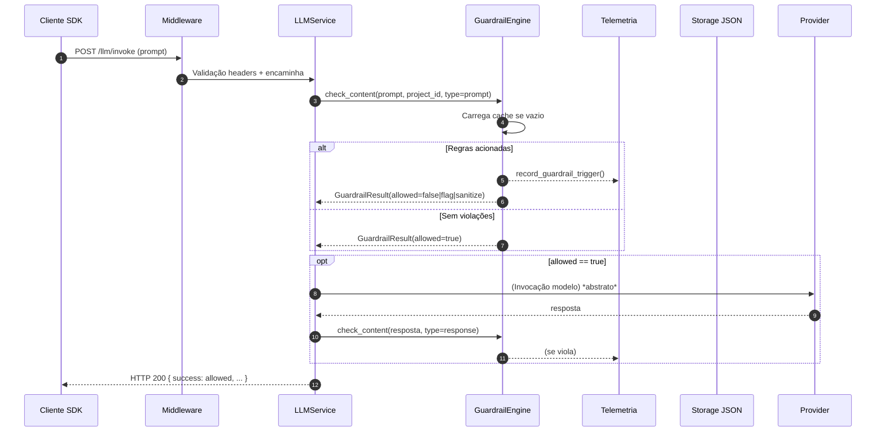

# Fluxo de Guardrails

## 🎯 Objetivo
Descrever o lifecycle completo de validação de conteúdo (entrada e saída) pelo GuardrailEngine, incluindo cache, telemetria e ações (BLOCK/FLAG/SANITIZE/ALLOW) sem depender de validação LLM opcional.

## 🔁 Visão Geral do Lifecycle


## 🧠 Componentes Envolvidos
- GuardrailEngine: Motor determinístico (regex + keywords + whitelist)
- TelemetryCollector: Persistência de eventos de violações (guardrail_events.json)
- LLMService: Orquestra chamadas de entrada/saída e aplica fail-soft
- Middleware: Garante headers obrigatórios antes de qualquer validação

## ⚙️ Etapas Detalhadas
1. Recepção da requisição com headers x-bradax-* válidos
2. LLMService chama `check_content` antes de invocar modelo
3. GuardrailEngine inicializa cache se necessário a partir de `data/guardrails.json`
4. Cada regra ativa avalia:
   - Keywords (case-insensitive) fora da whitelist
   - Regex combinada (`patterns` agregados)
5. Para cada violação:
   - Telemetria imediata com `record_guardrail_trigger`
   - Ação acumulada determina estado final (BLOCK/SANITIZE/FLAG)
6. Se BLOCK → não chama modelo → retorna 200 + `success=false`
7. Se SANITIZE → substitui trechos e segue com modelo
8. Se FLAG → segue normal, apenas anotado
9. Resposta do modelo (se houve) é novamente inspecionada (saída)
10. Resultado consolidado devolvido ao cliente (fail-soft)

## 🧪 Ações Suportadas
| Ação | Efeito | Código HTTP | Campo success | Observação |
|------|--------|-------------|---------------|------------|
| BLOCK | Não invoca modelo | 200 | false | Telemetria + lista de regras |
| SANITIZE | Invoca com conteúdo mascarado | 200 | true | Conteúdo modificado não vaza termos |
| FLAG | Invoca normal | 200 | true | Rastreamento futuro |
| ALLOW | Invoca normal | 200 | true | Sem anotações |

## 🔐 Fail-Soft vs Fail-Closed
- Fail-soft atual: bloqueios retornam 200 para não quebrar UX cliente (decisão reversível)
- Futuro (configurável): modo estrito retornando 4xx em contextos regulatórios

## 🗄️ Estrutura de Regras (data/guardrails.json)
Campos principais por regra:
- rule_id, name, severity (low|medium|high|critical)
- action (flag|block|sanitize)
- patterns { nome: regex }
- keywords [] + whitelist []
- category (content_safety, business, compliance, etc.)

## 🧮 Determinação de Severidade Predominante
Prioridade: CRITICAL > BLOCK (high) > WARNING > INFO

## 📊 Telemetria Capturada
- project_id
- endpoint
- content_type (prompt|response)
- rule_id & action
- violation_details[]
- severity

Arquivo: `guardrail_events.json` (append-only)

## 🧱 Estratégias de Redução de Falsos Positivos
- Whitelist contextual por regra
- Possível futura segunda camada LLM (off por padrão) para override de falso positivo
- Sanitização seletiva antes de bloquear (roadmap)

## 🚫 Limitações Atuais
- Sem agregação temporal (correlação multi-mensagens)
- Regex combinadas podem crescer em complexidade (monitorar performance)
- Não há versionamento de regras nativo (apenas sobrescrita JSON)

## 🧭 Roadmap Evolutivo
| Item | Descrição | Prioridade |
|------|-----------|------------|
| Versionamento de Regras | Snapshot incremental + diff | Alta |
| Modo Fail-Closed | Retornar 4xx seletivo | Média |
| Regras Contextuais | Estado conversacional | Média |
| Exceções Temporárias | TTL para whitelists | Baixa |
| UI Admin | Edição validada + preview regex | Alta |

## ✅ Critérios de Qualidade
- Adicionar regra não reinicia serviço (reload em memória)
- Cada violação registra evento em <50ms
- 0 vazamento de termos mascarados (SANITIZE)

## 🔍 Exemplo Simplificado de Resultado
```json
{
  "allowed": false,
  "triggered_rules": ["pii_email"],
  "severity": "block",
  "action": "BLOCK",
  "reason": "Bloqueado por 1 regra(s)",
  "metadata": {"content_type": "prompt", "project_id": "proj123"}
}
```

## 🧪 Testes Existentes
Arquivo `tests/integration/test_custom_guardrails_e2e.py` cobre:
- Bloqueio custom regex
- Permissão quando não há match
- Regex inválida (fail-fast no load)
- Fluxo via SDK real

---
*Documento gerado automaticamente (guardrails lifecycle)*
