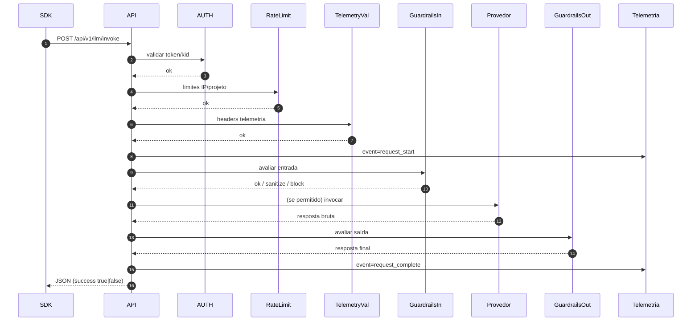

# Fluxo Detalhado: /llm/invoke

## 1. Objetivo
Canal central de orquestração de chamadas LLM com aplicação de políticas, guardrails e telemetria.

## 2. Sequência Completa

## 3. Falhas Possíveis
| Etapa | Erro | Resultado |
|-------|------|-----------|
| AUTH | Token inválido | 401/403 |
| RateLimit | Janela excedida | 429 |
| TelemetryVal | Header ausente | 403 |
| Guardrails In | Violação | 200 success=false |
| Provedor | Erro externo | 200 success=false + raw log |
| Guardrails Out | Violação | 200 success=false |

## 4. Bloqueio Encapsulado
Retorno 200 com `success=false`, `model_used=guardrail_blocked`, `guardrails_triggered=true`. Mantém semântica idempotente para clientes e evita retries agressivos baseados só em código de status.

## 5. Campos Fundamentais
| Campo | Fonte | Observação |
|-------|-------|-----------|
| request_id | SDK ou backend | Correlaciona todos os arquivos |
| project_id | Header/Token | Segmentação de políticas |
| model_id | Payload | Validado antes de invocar |
| custom_guardrails | Payload | Merge com padrão |
| guardrails_triggered | Serviço LLM | true se qualquer bloqueio/sanitização |

## 6. Arquivos Escritos
| Arquivo | Motivo |
|---------|--------|
| telemetry.json | start/complete/error |
| guardrail_events.json | bloquear/sanitizar |
| interactions.json | estágios detalhados |
| raw/responses/*.json | respostas erro/violação |

## 7. Métricas Deriváveis
- Tempo total request (diferença start/complete)
- Frequência de bloqueios
- Model mix (model_used agregação)
- Taxa de erro externo vs interno

## 8. Roadmap de Evolução Invoke
| Tema | Evolução |
|------|----------|
| Streaming | Suporte operation=stream |
| Batch | Execução paralela orquestrada |
| Replays | Reprocessar com novas regras |
| Circuit Breaker | Isolar falhas de provider |
| QoS | Priorização por projeto |
