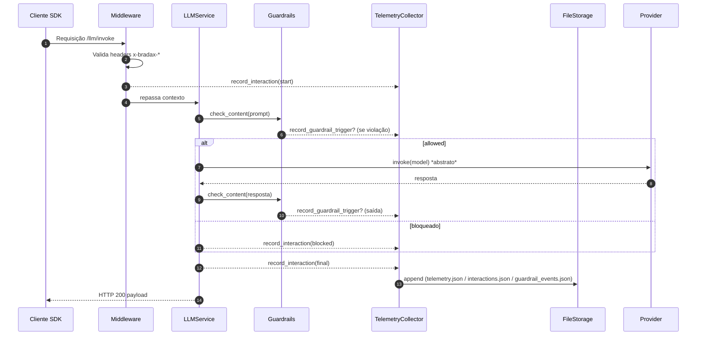

# Pipeline de Telemetria

## 🎯 Objetivo
Mapear coleta, validação, persistência e uso dos eventos gerados pelo hub (invocações, guardrails, auditoria sintética) de forma rastreável.

## 🔁 Sequência Geral


## 🧩 Tipos de Evento
| Tipo | Função | Arquivo |
|------|--------|---------|
| interaction | Metadados de cada chamada | interactions.json |
| telemetry | Métricas / estatísticas agregadas (básico) | telemetry.json |
| guardrail_event | Violações acionadas | guardrail_events.json |

## 🧷 Chaves Obrigatórias de Header
- x-bradax-project-id
- x-bradax-client-version
- user-agent prefixado (ex: bradax-sdk/)

Requisições sem esses metadados são rejeitadas antes de qualquer processamento.

## 📦 Persistência (Formato Simplificado)
```json
{
  "timestamp": "2025-08-20T00:10:00Z",
  "project_id": "proj123",
  "endpoint": "/llm/invoke",
  "latency_ms": 842,
  "guardrails": {"allowed": true, "triggered": []},
  "model": "abstract-provider-model",
  "success": true
}
```

## 🧮 Regras de Escrita
- Append line oriented (JSON array simplificado ou newline JSON) — atual: array completo regravado
- Escrita síncrona (risco de I/O maior) — futuro: buffer + flush
- Encoding UTF-8 forçado

## 📊 Métricas Derivadas (Potencial)
| Métrica | Fonte | Uso |
|---------|-------|-----|
| taxa_bloqueio_guardrails | guardrail_events.json | Ajustar regras |
| latência_p95 | interactions.json | SLO interno |
| tokens_médios | interactions.json | Otimização custo |
| prompts_bloqueados | interactions.json/guardrail_events | Segurança |

## 🔐 Considerações de Integridade
- Sem checksum por linha (futuro: SHA256 por evento)
- Sem rotação automática (futuro: daily rotation + compress)
- Risco de corrupção em crash (futuro: journal + commit log)

## 🛎️ Falhas e Degradação
| Falha | Comportamento Atual | Roadmap |
|-------|---------------------|---------|
| Erro de escrita | Log + segue fluxo | Circuit-breaker local |
| Arquivo inexistente | Exceção startup | Auto-criação segura |
| Corrupção JSON | Exceção load | Recovery incremental |

## 🧪 Testes & Observabilidade
Testes de integração cobrem headers obrigatórios + fluxo guardrails.
Futuro: teste de performance de append 1k eventos.

## 🧭 Roadmap Evolutivo
- Buffer em memória + flush intervalado
- Exporter plugin (stdout, Kafka, S3 abstrato)
- Assinatura criptográfica opcional
- Auto-rotação + políticas de retenção

## ✅ Critérios de Qualidade
- Zero perda de evento em fluxo nominal
- Latência extra de telemetria < 5% overhead
- Arquivos legíveis e auditáveis manualmente

---
*Documento gerado automaticamente (pipeline telemetria)*
